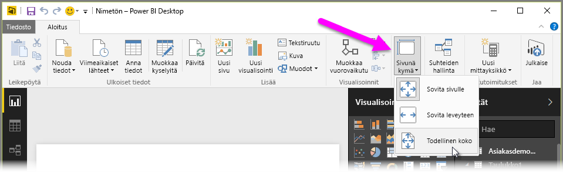
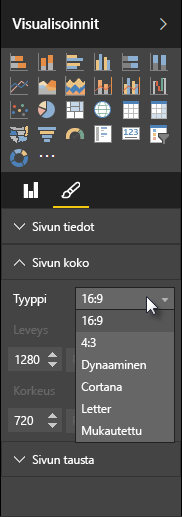

Power BI Desktopin avulla voi hallita raporttisivujesi asettelua ja muotoilua, kuten kokoa ja suuntaa.

Muuta raporttisivujesi skaalausta Aloitus-välilehden **Sivunäkymä**-valikon avulla. Käytettävissä olevat vaihtoehdot ovat **Sovita sivulle** (oletus), **Sovita leveyteen** ja **Todellinen koko**.

Voit myös muuttaa sivujen kokoa. Oletuksena raporttisivujen suhde on 16:9. Jos haluat muuttaa sivun kokoa, varmista, ettei yhtään visualisointia ole valittuna. Valitse sitten sivellinkuvake Visualisointi-ruudusta ja laajenna osa valitsemalla **Sivun koko**.

Sivun kokovaihtoehtoja ovat 4x3 (neliömäisempi kuvasuhde) ja Dynaaminen (sivu täyttää käytettävissä olevan tilan). Raporteissa voi käyttää myös Letter-vakiokokoa. Muista, että voit joutua muuttamaan visualisointien kokoa sivun koon muuttamisen jälkeen, jotta ne varmasti mahtuvat kokonaan pohjalle.

Voit myös määrittää mukautetun sivukoon, määrittää koon tuumien tai kuvapisteiden mukaan ja muuttaa koko raportin taustaväriä.

Toinen vaihtoehto on valita Cortana, joka määrittää raportin koon niin, että sitä voidaan käyttää Cortanalla tehtyjen hakujen tuloksena.

