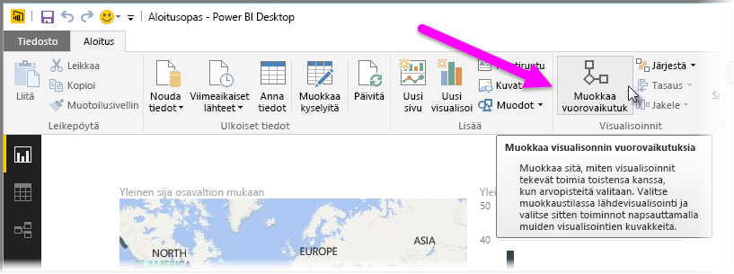
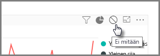
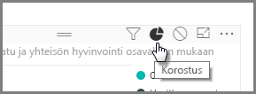
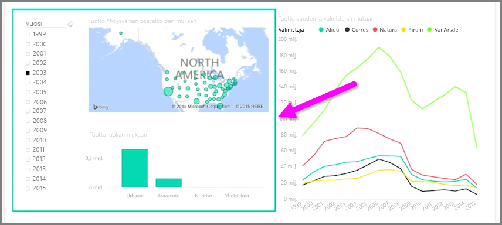

Kun samalla raporttisivulla on useita visualisointeja, tietyn segmentin valitseminen napsauttamalla sitä tai osittajan käyttäminen vaikuttaa kaikkiin sivulla oleviin visualisointeihin. Joissakin tapauksissa saatat kuitenkin haluta osittaa vain tietyt visualisoinnit. Näin on erityisesti käytettäessä pistekaavioiden kaltaisia elementtejä, joissa tietojen rajoittaminen tiettyyn segmenttiin poistaa ratkaisevan merkityksen. Onneksi Power BI Desktopissa on mahdollista hallita toimien vaikutusta visualisointeihin.

Jos haluat muuttaa visualisointien välistä vuorovaikutusta, valitse **Aloitus**-valintanauhan Visualisoinnit-osasta **Muokkaa** ja ota käyttöön **Muokkaustila**.

>[!NOTE]
>Power BI Desktopin **Muokkaa vuorovaikutuksia** -kuvake on muuttunut videon tallentamisen jälkeen.
> 
> 

Kun nyt valitset visualisoinnin raporttipohjalla, näet pienen läpinäkymättömän *suodatinkuvakkeen* oikeassa yläkulmassa kaikkien niiden visualisointien kohdalla, johon muutos vaikuttaa. Jos haluat jättää visualisoinnin pois vuorovaikutuksesta, napsauta *Ei mitään* -symbolia oikeassa yläkulmassa lähellä *suodatinkuvaketta*.

Joissakin tapauksissa voit muuttaa visualisointien välillä tapahtuvan suodatusvuorovaikutuksen tyyppiä. Kun **Muokkaustila** on käytössä, valitse suodatukseen käytettävä visualisointi. Jos voit muuttaa vuorovaikutuksen tyyppiä toisessa visualisoinnissa, oikeassa yläkulmassa suodatinkuvakkeen vieressä näkyy *ympyräkaaviokuvake*.

Korosta segmentoidut tiedot napsauttamalla *ympyräkaaviokuvaketta*. Muuten tiedot suodatetaan. Kuten aiemminkin, voit poistaa kaikki vuorovaikutukset napsauttamalla *Ei mitään* -kuvaketta.

Kätevä rakennevinkki on piirtää läpinäkyvä muoto toistensa kanssa vuorovaikutuksessa olevien visualisointien ympärille, jolloin käyttäjä näkee, että niillä on vuorovaikutteinen suhde.

