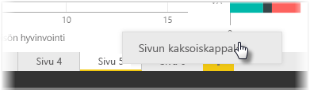

Raportin yksittäiset sivut voivat olla melko monimutkaisia ja sisältää useita visualisointeja, jotka ovat tietynlaisessa vuorovaikutuksessa ja joilla on tarkka muotoilu. Raporttia laatiessasi saatat joskus haluta käyttää samoja visualisointeja ja asetteluja kahdessa eri sivun aiheessa. Jos olet esimerkiksi koonnut raporttisivun bruttotuloista, saatat haluta lähes samanlaisen sivun nettotuloista.

Koko työn tekeminen uudelleen olisi hankalaa, mutta Power BI Desktopin avulla voit monistaa raporttisivun.

Napsauta kopioitavaa välilehteä hiiren kakkospainikkeella ja valitse **Monista sivu**.

Voit sitten nimetä sivun uuden välilehden tarvittaessa uudelleen, päivittää mahdollisen otsikkotekstin ja päivittää uuden seurattavan kentän visualisointeihin.

