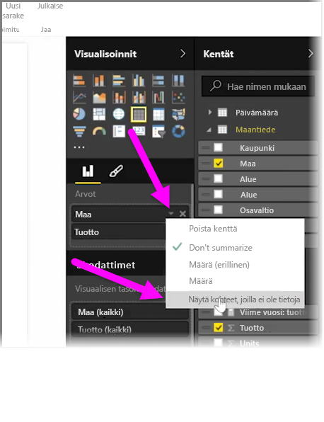
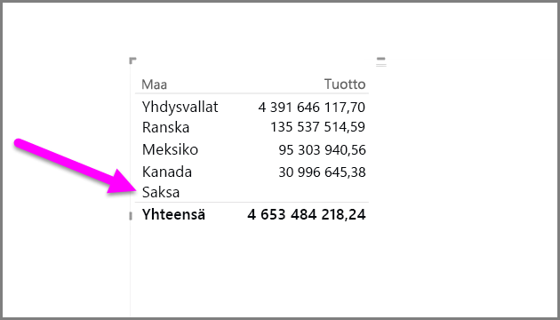
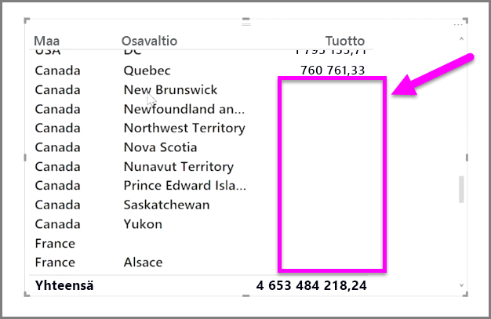

Oletuksena sarakeotsikot näytetään raporteissa vain, jos ne sisältävät tietoja. Jos esimerkiksi esität tulot maan mukaan eikä Norjassa ole myyntiä, Norja ei näy ollenkaan visualisoinnissa.

Jos haluat näyttää tyhjiä luokkia, napsauta alanuolta muutettavassa kentässä **Visualisoinnit**-ruudussa ja valitse **Näytä kohteet, joilla ei ole tietoja**.

Tyhjät sarakkeet näkyvät nyt visualisoinnissa tyhjillä arvoilla.

Kun valitset **Näytä kohteet, joilla ei ole tietoja** missä tahansa **Visualisoinnit**-ruudun kentässä, se koskee kaikkia Visualisoinnit-ruudussa näytettyjä kenttiä. Jos siis lisäät toisen kentän, myös kaikki kohteet, joilla ei ole tietoja, näytetään ilman, että avattavaa valikkoa tarvitsee käyttää uudelleen.

