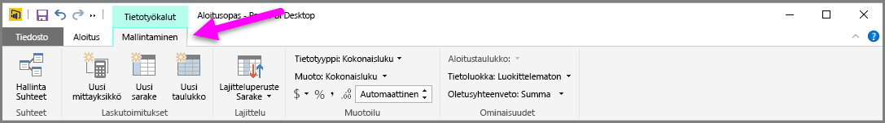
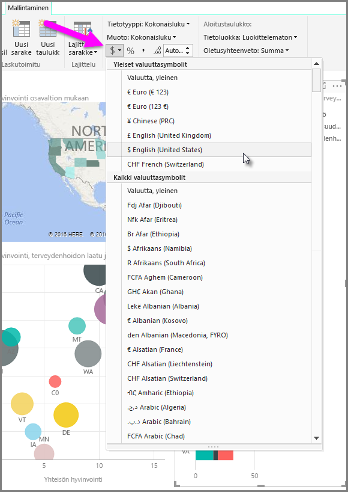
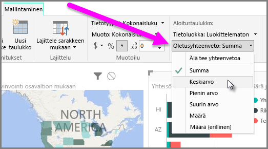
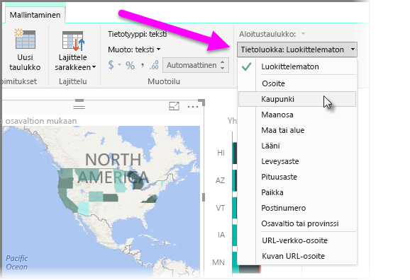

Power BI:ssä on ominaisuuksia, joita voit määrittää mallissasi oleville kentille ja joiden avulla voit visualisoida ja esittää tietoja selkeämmin. Saatat esimerkiksi joskus haluta esittää lukuluettelon keskiarvon, mutta Power BI laskee automaattisesti luettelon summan. Power BI:ssä voit määrittää, millainen yhteenveto kyseisistä lukuluetteloista luodaan.

## Yhteenvedon numeerinen hallinta
Esitetään esimerkin avulla, miten voidaan hallita tapaa, jolla Power BI luo yhteenvedon numeerisista tietokentistä.

Valitse visualisointi raporttipohjalla ja valitse sitten kenttä **Kentät**-ruudusta. Valintanauhassa on **Mallinnus**-välilehti, jossa näkyvät tietojen muotoiluvaihtoehdot ja tietojen ominaisuudet.

Voit valita käytettävän rahayksikön tunnustyypin valitsemalla rahayksikön tunnuksen avattavasta valikosta, joka näkyy seuraavassa kuvassa.

Muotoilukentille on useita eri vaihtoehtoja. Voit esimerkiksi muuttaa muotoa rahayksiköstä prosentiksi.

Voit muuttaa myös Power BI:n käyttämää tietojen yhteenvetotapaa. Napsauttamalla **Oletusyhteenveto**-kuvaketta voit muuttaa kentän yhteenvetotapaa, joita ovat summan, määrän tai keskiarvon näyttäminen.

## Sijaintitietojen hallinnoiminen ja selventäminen
Voit tehdä vastaavia muutoksia, kun merkitset sijainteja karttaan. Valitse kartta ja sitten **Kentät**-ruudusta kenttä, jota käytät *Sijainti*-arvona. Valitse **Mallinnus**-välilehdeltä **Tietoluokka** ja valitse sitten sijaintitietojasi edustava luokka avattavasta valikosta. Valitse esimerkiksi osavaltio, alue tai kaupunki.

