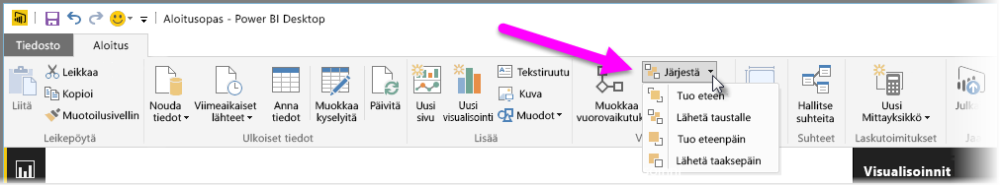
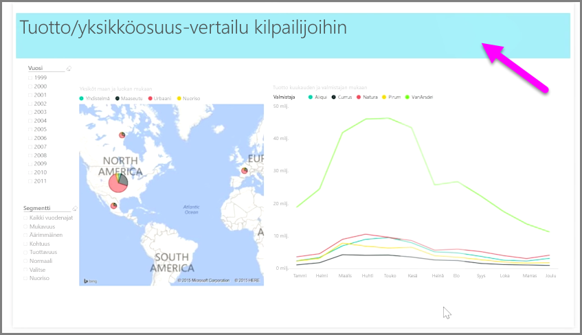

Kun raportissa on monta elementtiä, Power BI:n avulla voit hallita, miten ne limittyvät toisiinsa. Kohteiden kerrostusta tai päällekkäisyyttä kutsutaan usein z-järjestykseksi.

Jos haluat hallita raportin elementtien z-järjestystä, valitse elementti ja muuta järjestystä valintanauhan **Aloitus**-välilehden **Järjestä**-painikkeella.

**Järjestä**-painikkeen valikon vaihtoehtojen avulla saat raporttisi elementit haluamaasi järjestykseen. Voit siirtää visualisoinnin yhden kerroksen eteen- tai taaksepäin tai järjestyksen lopusta alkuun.

Järjestä-painike on erityisen hyödyllinen, kun käytetään muotoja, kuten koristeellisia taustoja tai reunoja, tai kun halutaan korostaa yksittäisen kuvion tai kaavion tiettyjä osia. Sen avulla voit myös luoda taustan, kuten seuraavan vaaleansinisen suorakulmion, jota käytetään raportin otsikon taustana.

