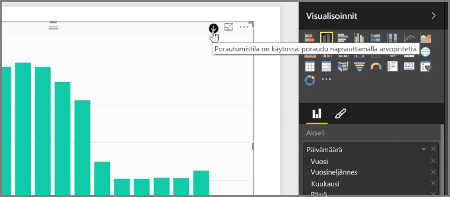

Kun lisäät visualisointiin *Päivämäärä*-kentän *Akseli*-kenttäryhmästä, Power BI lisää automaattisesti aikahierarkian, joka sisältää *Vuoden*, *Vuosineljänneksen*, *Kuukauden* ja *Päivän*. Näin Power BI mahdollistaa visualisointiesi aikaan perustuvan vuorovaikutuksen raporttiesi tarkastelijoiden kanssa, kun käyttäjät voivat siirtyä eri aikatasoille.

Kun hierarkia on määritetty, voit alkaa porautua aikahierarkiassa. Esimerkiksi kun kaaviossa napsautetaan vuotta, hierarkiassa poraudutaan seuraavaan tasoon, tässä tapauksessa *vuosineljänneksiin*, jotka näytetään visualisoinnissa.

Kyseisessä automaattisesti luodussa hierarkiassa voit myös hallita, mihin tasoon asti jaetussa raportissasi voidaan porautua. Napsauta tällöin Visualisoinnit-ruudussa X-merkkiä poistettavan hierarkian vieressä. Poistettu taso poistetaan raportista, eikä kyseistä tasoa enää näy porautumisessa.

Jos sinun on saatava kyseinen taso takaisin hierarkiaan, poista *Päivämäärä*-kenttä ja lisää se uudelleen **Kentät**-ruudusta, jolloin hierarkia luodaan jälleen automaattisesti.

Joissakin tilanteissa saatat haluta, ettei hierarkiaa käytetä visualisoinnissa. Voit hallita sitä napsauttamalla *Päivämäärä*-kentän vieressä olevaa alanuolipainiketta (lisättyäsi kentän visualisointiin) ja valitsemalla **Päivämäärä** **Päivämäärähierarkia**-valinnan sijaan. Tällöin Power BI näyttää raakapäivämääräarvot visualisoinnissa.

Voit myös laajentaa kaikki näkyvissä olevat tietoelementit kerralla yksittäisen vuosineljänneksen tai vuoden valitsemisen sijaan. Napsauta tällöin visualisoinnin vasemmassa yläkulmassa olevaa *Poraudu kaikkiin* -kuvaketta, joka on kaksoisalanuoli.

