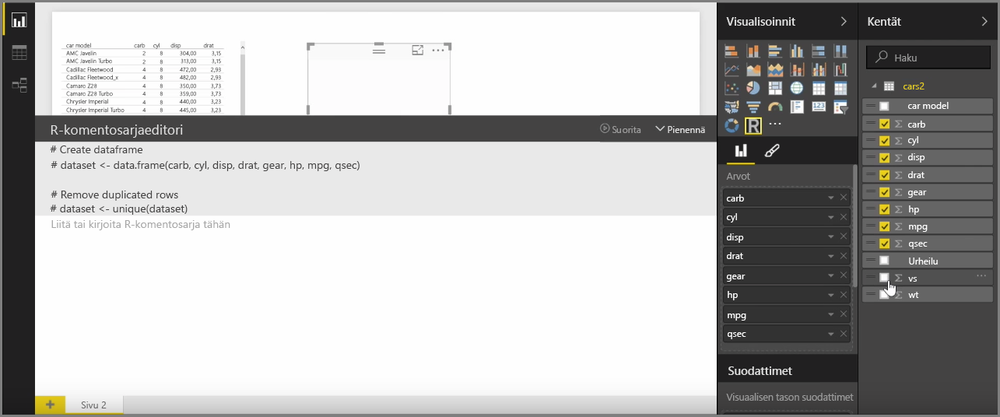
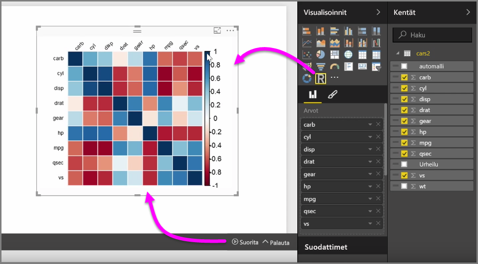
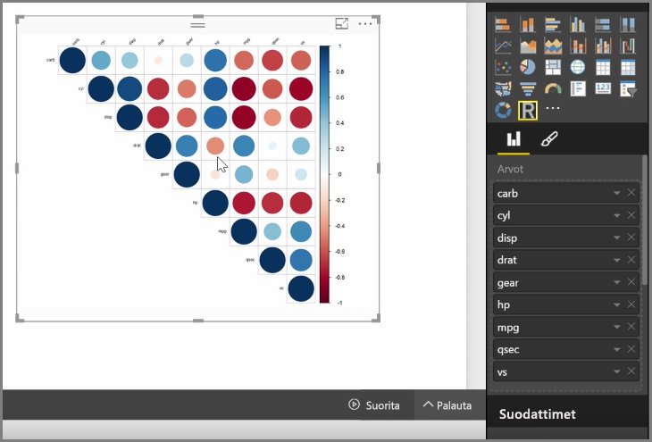
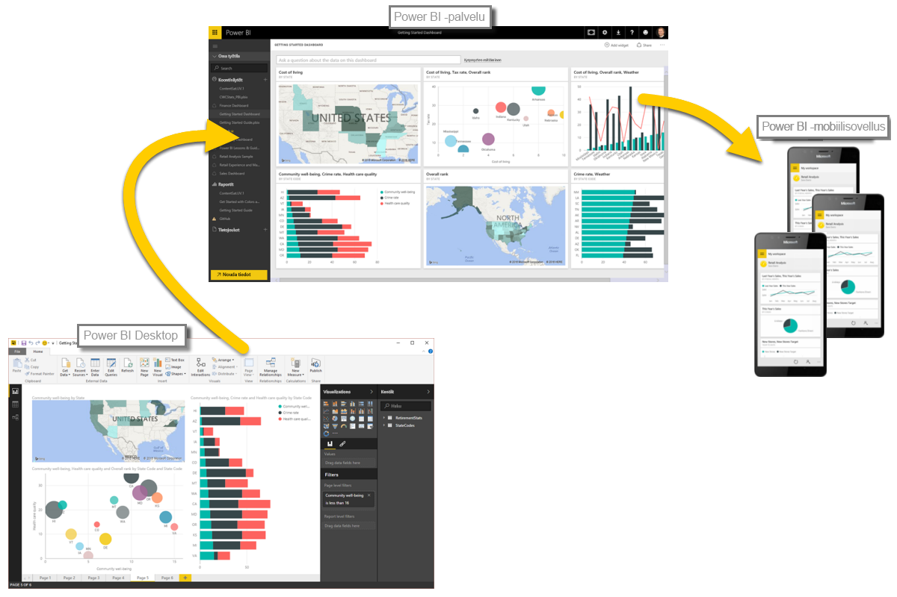

Power BI Desktopilla voit tehdä analyyttisiä ja tilastollisia analyyseja ja luoda vakuuttavia visualisointeja R-integroinnin avulla. Voit esittää kyseisiä R-visualisointeja Power BI Desktop -raportissa.

Kun napsautat **R-visualisointi**-kuvaketta **Visualisoinnit**-ruudussa, Power BI luo pohjalle paikkamerkin R-visualisointia varten ja esittää R-komentosarjaeditorin, jota voit käyttää suoraan pohjalla. Sitä mukaa kun lisäät kenttiä R-visualisointiin, Power BI Desktop lisää ne R-komentosarjaeditoriruutuun.

Voit alkaa luoda R-komentosarjaa visualisoinnin luomiseksi sen alapuolelle, mitä Power BI luo R-komentosarjaeditorissa. Kun komentosarja on valmis, valitse **Suorita**, jolloin tapahtuu seuraavaa:

1. Visualisointiin (**Kentät**-ruudusta) lisätyt tiedot lähetetään Power BI Desktopista paikalliseen R-asennukseen.
2. Power BI Desktopin R-komentosarjaeditorissa luotu komentosarja suoritetaan paikallisessa R-asennuksessa.
3. Power BI Desktop saa visualisoinnin takaisin R-asennuksesta ja näyttää sen pohjalla.

Kaikki tapahtuu melko nopeasti, ja tulos näkyy **R-visualisoinnissa** pohjalla.

Voit muuttaa R-visualisointia muuttamalla R-komentosarjaa ja valitsemalla uudelleen **Suorita**. Seuraavassa kuvassa visualisointia on muutettu näyttämään ympyröitä neliöiden sijaan.

Koska R-visualisointi on aivan kuin mikä tahansa muu visualisointi Power BI Desktopissa, voit tehdä sille toimia ja luoda yhteyksiä myös muihin pohjalla oleviin visualisointeihin. Kun teet toimia muille pohjalla oleville visualisoinneille suodattamalla tai korostamalla, R-visualisointi toimii automaattisesti samalla tavoin kuin mikä tahansa muu Power BI -visualisointi ilman R-komentosarjan muuttamista.

Se on erinomainen tapa hyödyntää R:n teho suoraan Power BI Desktopissa.

## Seuraavat vaiheet
**Onnittelut!** Olet nyt suorittanut **Visualisoinnit**-osion Power BI:n **Ohjattu oppiminen** -kurssista. Voit pitää itseäsi monien Power BI:n tarjoamien visualisointien asiantuntijana ja osaat myös käyttää, muokata ja mukauttaa niitä. Hyviä uutisia: visualisoinnit ovat olennaisilta osiltaan samoja Power BI Desktopissa ja Power BI -palvelussa, joten oppimasi taidot pätevät kumpaankin.

Olet nyt valmis siirtymään pilveen ja perehtymään Power BI -palveluun, jossa voit **tutkia tietoja**. Kuten tiedät, työnkulku näyttää seuraavanlaiselta:

* Tuo tiedot **Power BI Desktopiin** ja luo raportti.
* Julkaise Power BI -palvelussa, jossa voit luoda uusia **visualisointeja** ja laatia koontinäyttöjä.
* **Jaa** koontinäytöt muille, erityisesti toimistosta poissa oleville.
* Tarkastele jaettuja koontinäyttöjä ja raportteja ja tee niille toimia **Power BI -mobiilisovelluksissa**.

Luotpa sitten raportteja tai vain tarkastelet niitä tai teet niille toimia, tiedät nyt, miten hienoja visualisointeja luodaan ja miten ne liittyvät tietoihin. Seuraavaksi nähdään visualisoinnit ja raportit toiminnassa.

Nähdään seuraavassa osiossa!

