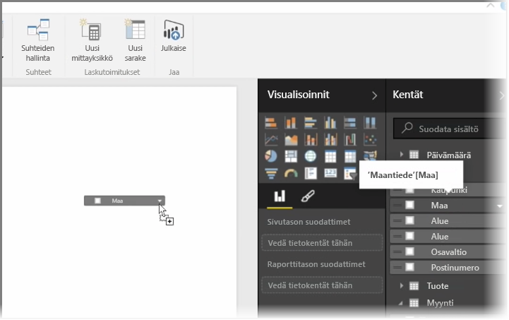
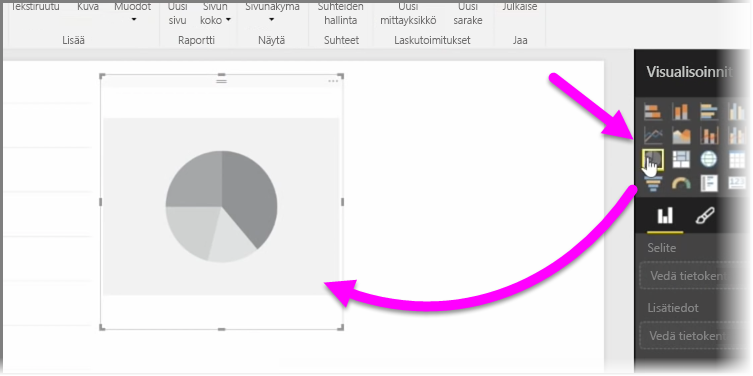
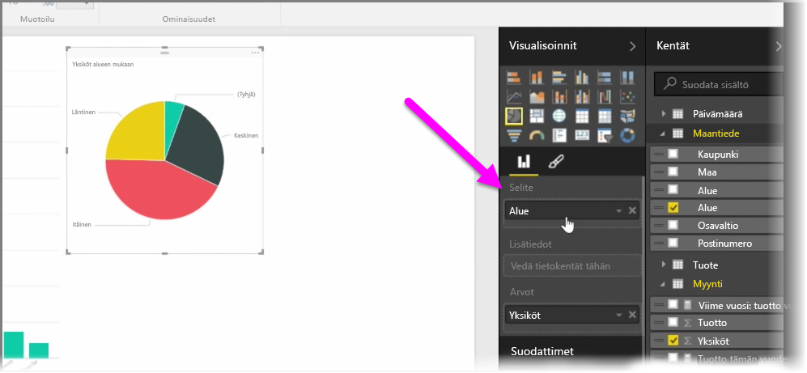
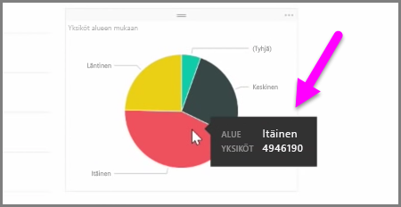
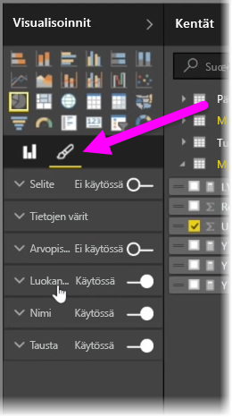

Tässä artikkelissa opit luomaan uusia palkkikaavioita, ympyräkaavioita ja puukarttoja ja mukauttamaan ne raportteihisi.

Uuden visualisoinnin voi luoda kahdella tapaa Power BI Desktopissa:

* Voit vetää kenttien nimet **Kentät**-ruudusta ja pudottaa ne raporttipohjalle. Visualisointi näkyy oletuksena tietotaulukkona.
  
  
* Voit myös napsauttaa **Visualisoinnit**-ruudussa visualisointityyppiä, jonka haluat luoda. Tällöin oletusvisualisointi on tyhjä paikkamerkki, joka näyttää valitsemaltasi visualisointityypiltä.
  
  

Kun olet luonut kaavion, kartan tai kuvion, voit luoda ja järjestää visualisointisi vetämällä tietokenttiä **Visualisointi**-ruudun alaosaan. Käytettävissä olevat kentät vaihtelevat valitun visualisointityypin perusteella. Kun vedät ja pudotat tietokenttiä, muutokset päivitetään visualisointiin automaattisesti.

Voit muuttaa visualisoinnin kokoa valitsemalla sen ja vetämällä kahvoja sisään- tai ulospäin. Voit myös siirtää visualisoinnin mihin tahansa kohtaan pohjalla napsauttamalla ja vetämällä sitä. Jos haluat vaihtaa visualisointityypistä toiseen, valitse muutettava visualisointi ja valitse sitten toinen visualisointi **Visualisointi**-ruudun kuvakkeista. Power BI yrittää muuttaa valitsemasi kentät uuteen visualisointityyppiin mahdollisimman tarkasti.

Kun siirrät hiiren osoitinta visualisointien osien päällä, näet työkaluvihjeen, joka sisältää kyseistä segmenttiä koskevia tietoja, kuten otsikoita ja kokonaisarvon.

Jos haluat tehdä muutoksia visualisoinnin ulkonäköön, kuten taustan tasaukseen, otsikkotekstiin tai tietojen väreihin, valitse **sivellinkuvake** **Visualisoinnit**-ruudusta.

Vaihtoehdot visualisoinnin ulkonäön muuttamiseksi vaihtelevat valitsemasi visualisointityypin mukaan.

