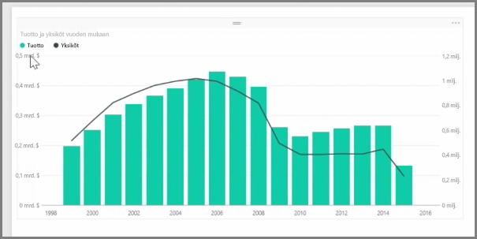
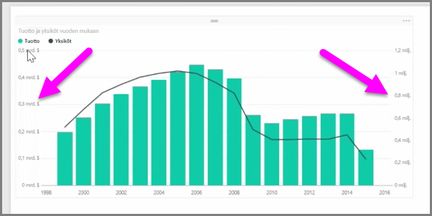
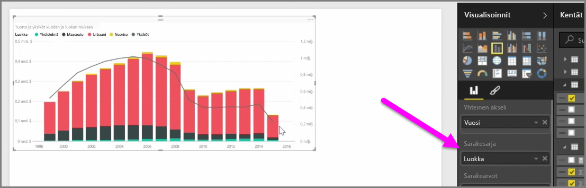

Kun haluat visualisoida kaksi mittaria, joiden asteikot ovat hyvin erilaiset, kuten tulot ja yksiköt, viivan ja pylvään eri akselien asteikoilla näyttävä **yhdistelmäkaavio** on erittäin kätevä. Power BI tukee oletuksena monia erityyppisiä yhdistelmäkaavioita, kuten suosittuja **Viiva**- ja **Pinottu pylväs** -kaavioita.

Kun luot yhdistelmäkaavion, näet **Yhteinen akseli** (X-akseli) -kentän ja kahden kentän arvot, tässä tapauksessa pylvään ja viivan. Kahden Y-akselin selitteet näkyvät visualisoinnin kummallakin puolella.

Voit myös jakaa jokaisen pylvään osiin luokan mukaan vetämällä luokan Visualisoinnit-ruudun Sarakesarja-kenttään. Kun teet niin, jokainen pylväs väritetään kunkin luokan arvojen mukaan.

Yhdistelmäkaaviot ovat tehokas tapa visualisoida useita asteikoltaan hyvin erilaisia mittareita yhdessä visualisoinnissa.

