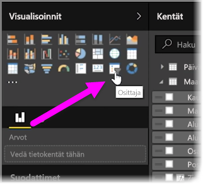
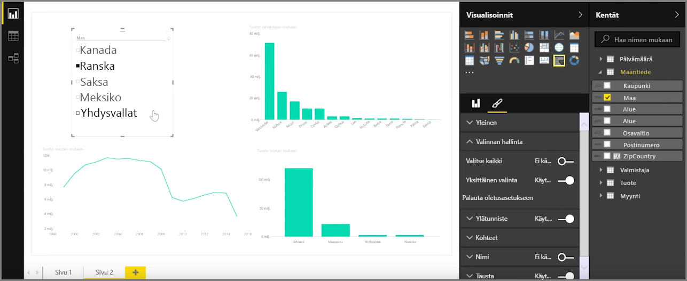
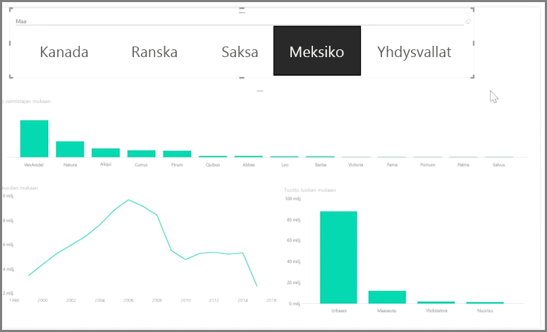

Osittajat ovat yksi tehokkaimmista visualisointityypeistä erityisesti runsaan raportin osana. **Osittaja** on **Power BI Desktopin** pohjan visuaalinen suodatin, jonka avulla kuka tahansa raportin tarkastelija voi segmentoida tiedot tietyn arvon, kuten vuoden tai maantieteellisen sijainnin mukaan.

Lisää raporttiisi osittaja valitsemalla **Osittaja** **Visualisoinnit**-ruudusta.

Vedä ja pudota ositettava kenttä osittajapaikkamerkin yläosaan. Visualisointi muuttuu valintaruudut sisältäväksi elementtiluetteloksi. Elementit ovat suodattimiasi: valitse segmentoitavan elementin viereinen valintaruutu, jolloin kaikki muut saman raporttisivun visualisoinnit suodatetaan tai *ositetaan* valintasi mukaan.

Osittajan muotoiluun on käytettävissä muutama eri vaihtoehto. Voit määrittää sen hyväksymään useita syötteitä kerralla tai käytä yhtä kerrallaan ottamalla **Yksittäinen valinta** -tila käyttöön. Voit myös lisätä osittajan elementteihin **Valitse kaikki** -vaihtoehdon, josta on hyötyä, kun luettelo on erityisen pitkä. Voit muuttaa osittajan suuntaa oletusarvoisesta pystystä vaakaan, jolloin siitä tulee valintarivi tarkistusluettelon sijaan.

