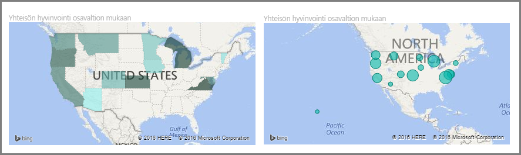
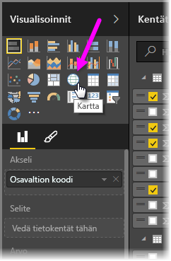
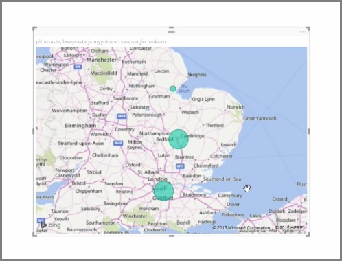
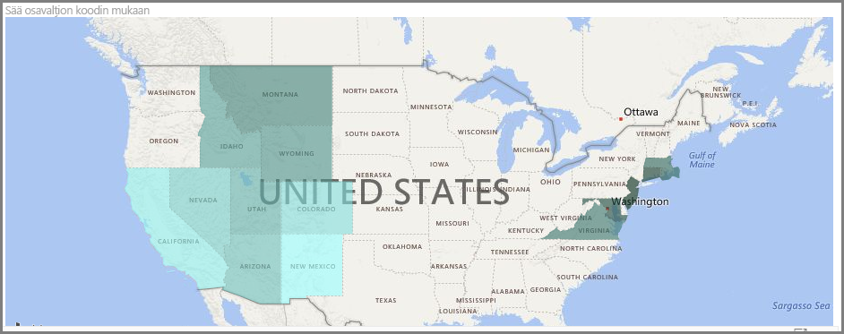
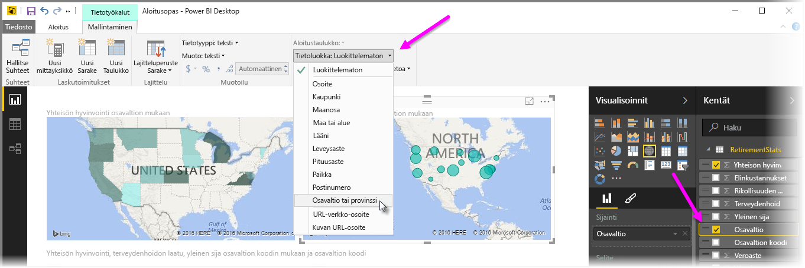

Power BI:ssä on kaksi erityyppistä karttavisualisointia: kuplakartta, jossa maantieteellisen pisteen päälle asetetaan kupla, ja muotokartta, joka näyttää visualisoitavan alueen ääriviivat.

> [!NOTE]
> Kun käsittelet maita tai alueita, käytä kolmikirjaimisia lyhenteitä, jotta sijaintitietojen lisääminen toimii varmasti oikein karttavisualisoinneissa. *Älä* käytä kaksikirjaimisia lyhenteitä, koska silloin joitakin maita tai alueita ei välttämättä tunnisteta oikein.
> Jos käytettävissäsi on vain kaksikirjaimisia lyhenteitä, lue [tämä ulkoinen blogikirjoitus](https://blog.ailon.org/how-to-display-2-letter-country-data-on-a-power-bi-map-85fc738497d6#.yudauacxp), jossa kerrotaan, miten voit yhdistää kaksikirjaimiset maa-/aluelyhenteet kolmikirjaimisiin.
> 
> 

## Kuplakarttojen luominen
Luo kuplakartta valitsemalla **Kartta**-vaihtoehto **Visualisointi**-ruudusta. Sinun on lisättävä arvo **Visualisoinnit**-vaihtoehtojen *Sijainti*-ryhmään, jotta voit käyttää karttavisualisointia.

Power BI on joustava hyväksyttävän sijaintiarvon tyypin suhteen: sijaintiarvo voi olla yleisempi, kuten kaupungin nimi tai lentokentän koodi, tai erittäin tarkka leveys- ja pituusastetieto. Muuta kuplan kokoa kunkin karttasijainnin mukaan lisäämällä kenttä **Koko**-ryhmään.

## Muotokarttojen luominen
Luo muotokartta valitsemalla **Täytetty kartta** -vaihtoehto Visualisointi-ruudusta. Kuten kuplakartoissakin, sinun on lisättävä jonkinlainen arvo Sijainti-ryhmään, jotta voit käyttää tätä visualisointia. Lisää kenttä Koko-ryhmään täyttövärin voimakkuuden muuttamiseksi.

Visualisoinnin vasemmassa yläkulmassa oleva varoituskuvake ilmaisee, että karttaan on lisättävä sijaintitietoja, jotta arvot voidaan merkitä tarkasti. Tämä on erityisen yleinen ongelma, kun sijaintikentän tiedot ovat monitulkintaisia, esimerkiksi jos alueen nimenä on *Washington*, joka voi tarkoittaa osavaltiota tai kaupunkia. Yksi tapa ratkaista tämä ongelma on nimetä pylväs tarkemmin uudelleen, esimerkiksi *Osavaltioksi*. Toinen ratkaisukeino on nollata tietoluokka manuaalisesti valitsemalla **Tietoluokka** Mallinnus-välilehdeltä. Siellä voit määrittää tiedoillesi luokan, esimerkiksi Osavaltio tai Kaupunki.

