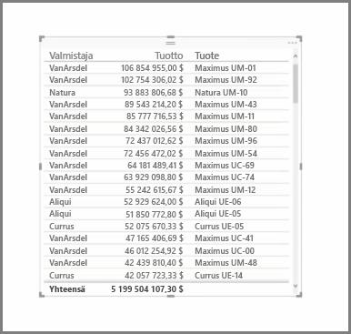
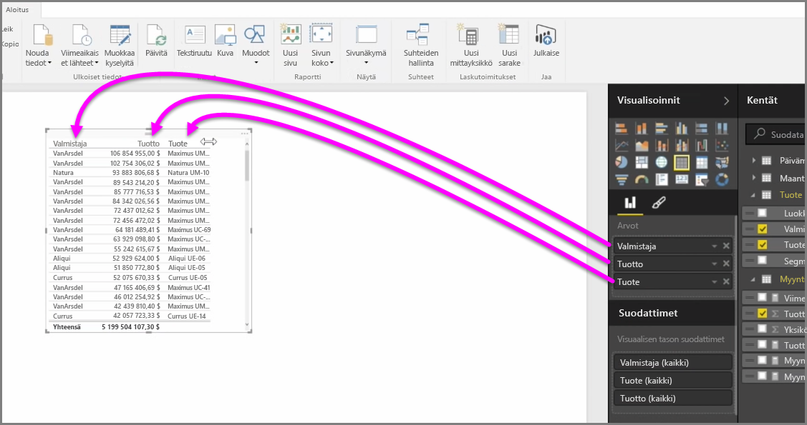
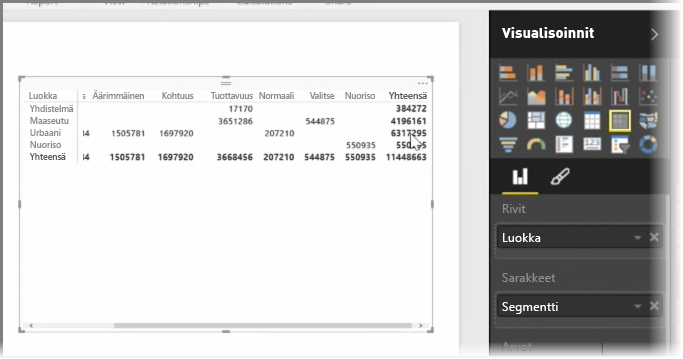

Runsaiden kaavioiden lisäksi Power BI Desktop tukee myös taulukkovisualisointeja. Itse asiassa, kun tartut luokkakenttään tai tekstikenttään ja vedät sen raporttipohjalle, saat oletuksena tulostaulukon. Voit vierittää ylös ja alas taulukossa, ja se on alun perin lajiteltu aakkosjärjestyksessä.

Jos taulukossa on numeerista tietoa, kuten tuloja, kokonaissumma näkyy alhaalla. Voit lajitella kunkin sarakkeen manuaalisesti napsauttamalla sen otsikkoa ja vaihtamalla nousevaan tai laskevaan järjestykseen. Jos sarakkeen leveys ei riitä koko sisällön näyttämiseen, laajenna sitä napsauttamalla otsikkoa ja vetämällä sitä sivusuuntaan.

**Visualisoinnit**-ruudun *Arvot*-ryhmän kenttien järjestys määrittää, missä järjestyksessä ne näkyvät taulukossasi.

**Matriisi** samanlainen kuin taulukko, mutta sen luokkien otsikot sarakkeissa ja riveillä ovat erilaiset. Kuten taulukoissakin, numeeristen tietojen summa lasketaan automaattisesti yhteen matriisin alaosaan ja oikeaan reunaan.

Matriisien ulkoasun muuttamiseen on käytettävissä monia vaihtoehtoja, kuten sarakkeiden koon automaattinen muuttaminen, rivien ja sarakkeiden summien käyttöön ottaminen ja värien määrittäminen. Kun luot matriisin, varmista, että luokkatiedot (muut kuin numerotiedot) ovat matriisin vasemmalla puolella ja numerotiedot oikealla puolella, jotta vaakavierityspalkki näkyy ja vieritys toimii oikein.

