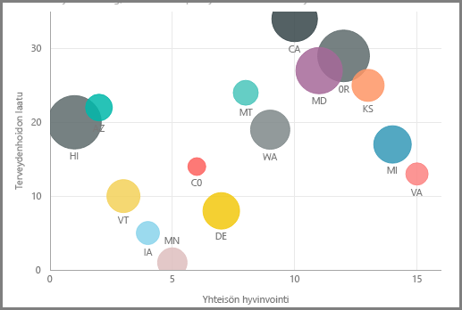

Jos haluat verrata kahta eri mittaria, kuten yksikkömyyntiä ja tuloja, yleensä visualisointina käytetään pistekaaviota.

Luo tyhjä kaavio valitsemalla **Pistekaavio** **Visualisoinnit**-ruudusta. Vedä ja pudota kaksi kenttää, joita haluat verrata, **Kentät**-ruudusta *X-akseli*- ja *Y-akseli*-vaihtoehtoryhmiin. Tässä vaiheessa pistekaaviossasi on todennäköisesti vain pieni kupla keskellä visualisointia. Sinun on ilmoitettava, miten haluat segmentoida tiedot, lisäämällä mittari *Tiedot*-ryhmään. Jos esimerkiksi vertaat nimikkeen myyntiä ja tuloja, saatat haluta jakaa tiedot luokan tai valmistajan tai myyntikuukauden mukaan.

Ylimääräisen kentän lisääminen *Selite*-ryhmään värittää kuplat kentän arvon mukaan. Voit myös lisätä kentän *Koko*-ryhmään kuplan koon muuttamiseksi kyseisen arvon mukaan.

Pistekaavioille on myös monia visuaalisia muotoiluvaihtoehtoja, kuten värillisten kuplien ääriviivat ja yksittäisten otsikoiden käyttöön ottaminen. Voit muuttaa myös muiden kaaviotyyppien tietojen värejä.

Voit luoda animaation kuplakaaviosi muutoksista ajan mittaan lisäämällä aikaa perustuvan kentän *PlayAxis*-ryhmään. Napsauta kuplaa animaation aikana, niin näet sen polun.

>[!NOTE]
>Muista, että jos näet vain yhden kuplan pistekaaviossasi, sen johtuu siitä, että Power BI koostaa tietojasi, mikä on oletustoiminta. Lisäämällä luokan **Visualisoinnit**-ruudun *Tiedot*-ryhmään saat lisää kuplia.
> 
> 

