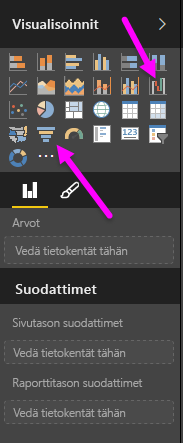
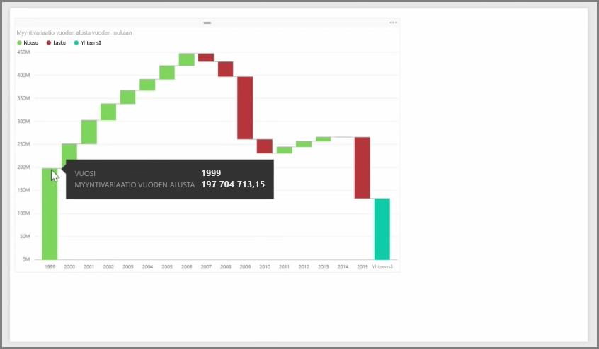
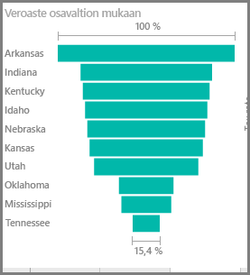

Vesiputous- ja suppilokaaviot ovat kaksi kiinnostavimmista (ja ehkä epätavanomaisimmista) Power BI:hin sisältyvistä visualisoinneista. Luo jommankumman tyyppinen tyhjä kaavio valitsemalla sen kuvake **Visualisoinnit**-ruudusta.

**Vesiputouskaavioita** käytetään usein näyttämään tietyn arvon muutokset ajan mittaan.

Vesiputouskaavioissa vain kaksi ryhmävaihtoehtoa: *Luokan* ja *Y-akselin*. Vedä aikaan perustuva kenttä, kuten *vuosi*, *Luokka*-ryhmään ja seurattava arvo *Y-akseli*-ryhmään. Ajanjaksot, joina arvo nousi, näytetään oletuksena vihreinä, ja ajanjaksot, joina arvo laski, näytetään punaisina.

**Suppilokaavioita** käytetään yleensä näyttämään muutokset tietyssä prosessissa, kuten myyntiputkessa tai verkkosivustolla pysymisessä.

Sekä **Vesiputous**- että **Suppilokaaviot** voidaan osittaa ja mukauttaa visuaalisesti.

