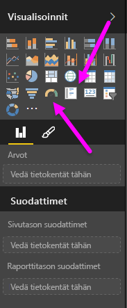
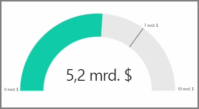
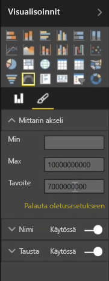
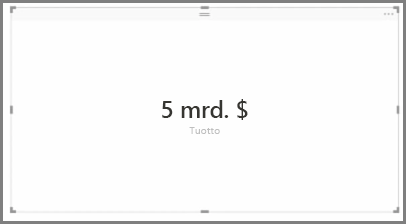
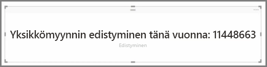

Yleensä visualisointeja käytetään kahden tai useamman eri arvon vertailuun. Saatat kuitenkin joskus raportteja laatiessasi haluta seurata vain yhtä suorituskykyilmaisinta tai arvoa ajan kuluessa. Tämä onnistuu Power BI Desktopissa **Mittari**- tai **Yksittäinen numero** -kortin visualisoinnilla. Luo jommankumman tyyppinen tyhjä kaavio valitsemalla sen kuvake **Visualisoinnit**-ruudusta.

Mittarit ovat erityisen hyödyllisiä, kun luot koontinäyttöjä ja haluat näyttää etenemisen tiettyyn tavoitteeseen. Luo mittari valitsemalla sen kuvake **Visualisoinnit**-ruudusta ja vedä seurattava kenttä *Arvo*-ryhmään.

Mittarit näyttävät oletuksena 50 % *Arvosta* tai arvon kaksinkertaisena, ja tätä asetusta voi muuttaa kahdella tapaa. Määritä arvot dynaamisesti vetämällä kentät Arvo-ryhmiin *Pienin*, *Suurin* ja *Tavoite*. Voit myös mukauttaa mittarin alueen manuaalisesti visuaalisten muotoiluvaihtoehtojen avulla.

Korttivisualisoinnit näyttävät kentän numeerisen esityksen. Korttivisualisoinneissa käytetään oletuksena näyttöyksiköitä numeroiden lyhentämiseksi, näytetään esimerkiksi ”5 mrd $” eikä ”5 000 000 000 $”. Voit muuttaa käytettävää yksikköä tai poistaa sen kokonaan käytöstä visuaalisissa muotoiluasetuksissa.

Eräs mielenkiintoinen tapa käyttää kortteja on näyttää niissä mukautettu mittari, johon olet yhdistänyt tekstin. Jos käytetään aiempaa esimerkkiä, mukautetun mittarin avulla korttisi voisi sisältää DAX-lisäfunktioita ja esimerkiksi tekstin ”Kokonaistulot tänä vuonna: 5 mrd $” tai ”Yksikkömyynnin kehitys tänä vuonna:” ja kehitystä vastaavan luvun.

