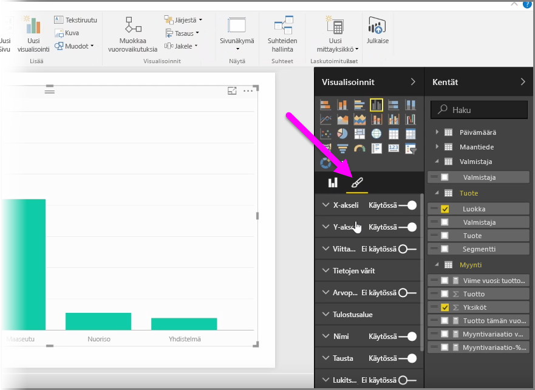
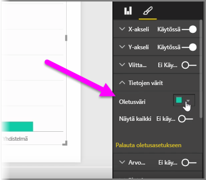
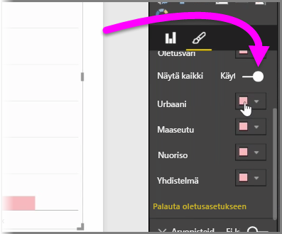
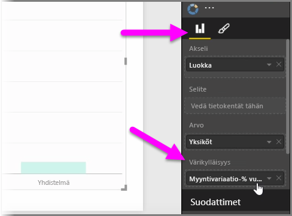
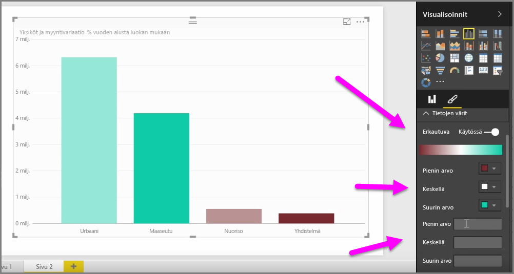
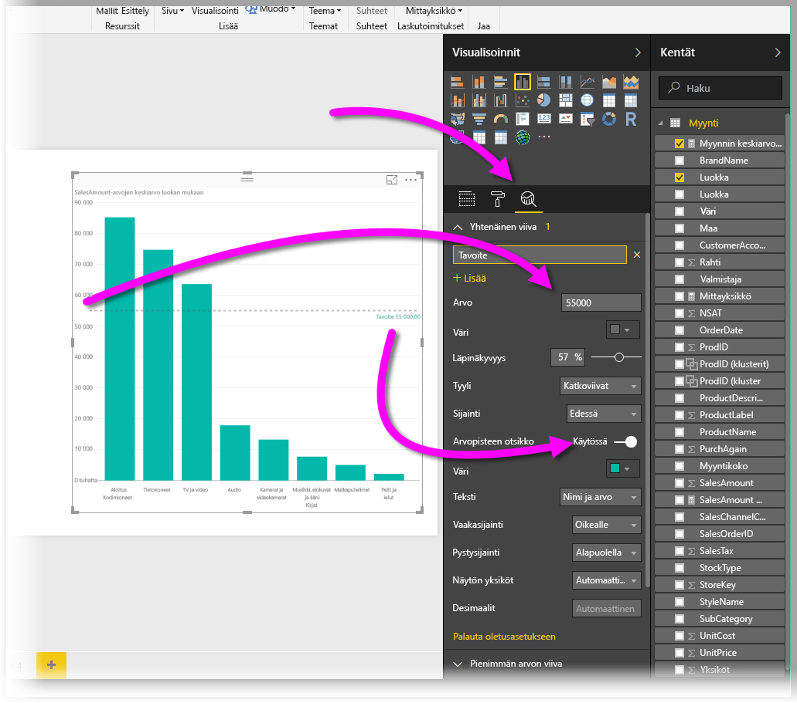
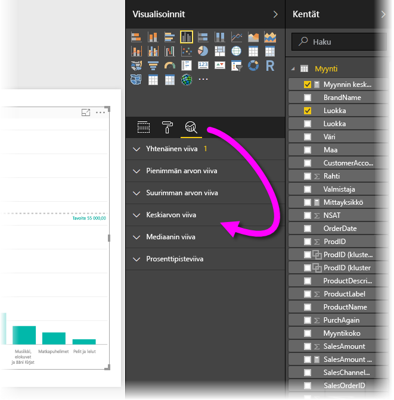

Saatat usein haluta muokata kaavioissa tai visualisoinneissa käytettyjä värejä. Power BI tarjoaa useita mahdollisuuksia värien näyttämisen hallintaan. Aloita valitsemalla visualisointi ja napsauta sitten **sivellinkuvaketta** **Visualisoinnit**-ruudussa.

Visualisoinnin värien tai muotoilun muuttamiseen on monia vaihtoehtoja. Voit muuttaa kaikkien visualisoinnin palkkien väriä valitsemalla **Oletusväri**-kohdan vieressä olevan värinvalitsimen ja valitsemalla sitten haluamasi värin.

Voit myös muuttaa kunkin palkin (tai muun elementin valitsemasi visualisointityypin mukaan) siirtämällä **Näytä kaikki** -liukusäätimen On-asentoon. Tällöin jokaisen elementin kohdalla näkyy värinvalitsin.

Voit myös muuttaa väriä arvon tai mittarin perusteella. Vedä tällöin kenttä Visualisoinnit-ruudun **Värikylläisyys**-ryhmään (huomaa, että se on käytettävissä **kenttien yhteenveto** -osassa eikä **sivellin**-osassa).

Lisäksi voit muuttaa asteikkoa ja värejä, joita käytetään tietoelementtien täyttöön. Voit myös valita eriytyvän asteikon siirtämällä Eriytyvä-liukusäätimen Päällä-asentoon, jolloin väri muuttuu asteittain kolmen värin välillä. Voit määrittää kaaviossa näytettävät arvot *Pienin*, *Keskimmäinen* ja *Suurin*.

Voit myös käyttää kyseisiä arvoja sääntöjen luomiseen, esimerkiksi nollaa suuremmat arvot tietylle värille ja nollaa pienemmät arvot toiselle värille.

Toinen kätevä työkalu värien käyttämiseen on *yhtenäisen viivan* eli *viiteviivan* määrittäminen. Voit asettaa yhtenäisen viivan arvon ja värin ja jopa määrittää viiveviivalle otsikon. Jos haluat luoda yhtenäisen viivan (ja muita kiinnostavia viivoja), valitse **Analysointi**-ruutu (näyttää suurennuslasilta) ja laajenna sitten **Viiteviiva**-osa.

Voit luoda visualisointiin monia muitakin viivoja, jotka myös löytyvät **Analysointi-ruudusta**, esimerkiksi pienimmän ja suurimman arvon viivat sekä keskiarvo-, mediaani- ja prosenttipisteviivat.

Lopuksi voit luoda reunan yksittäisen visualisoinnin ympärille ja muiden ohjausten tapaan määrittää reunan värin.

