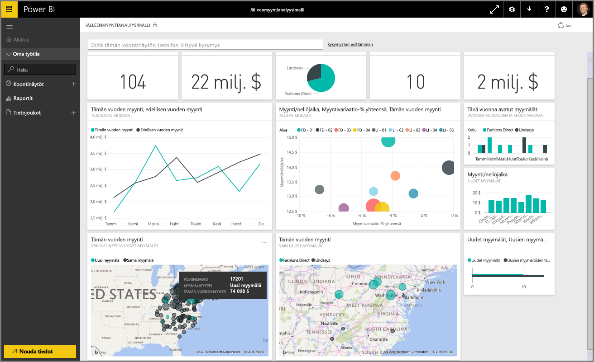

Tervetuloa Power BI:n **Ohjattu oppiminen** -kurssin **Tietojen tutkiminen** -osioon. Nyt kun hallitset Power BI Desktopin ja tietojen haun ja visualisoinnin, voit siirtyä Power BI -palvelun tietojen tutkimiseen.

Tässä osiossa opitaan monia eri asioita, ja Power BI:n mukaansatempaava vuorovaikutteisuus ja jakaminen todella erottuvat. Valmistaudu siis kiehtovaan ja mielenkiintoiseen osioon.

## Johdanto Power BI -palveluun
*Katso, mitä hyötyä Power BI -palvelusta on organisaatiollesi*

Power BI -palvelu on **Power BI Desktopin** luontainen jatke, ja sen ominaisuuksia ovat raporttien lataaminen, koontinäyttöjen luominen ja kysymysten esittäminen tiedoistasi luonnollisella kielellä. Palvelun avulla voit määrittää päivämäärän päivitysajat, jakaa tietoja organisaatiosi kanssa ja luoda mukautettuja Service Pack -paketteja.

Seuraavissa aiheissa perehdymme Power BI -palveluun ja näytämme sinulle, miten voit sen avulla muuttaa liiketoimintatiedot merkityksellisiksi tiedoiksi ja päätöksiin perustuvaksi yhteistyöympäristöksi.

