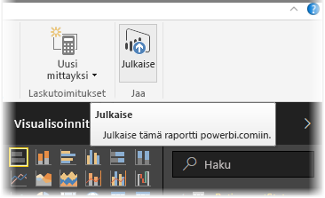
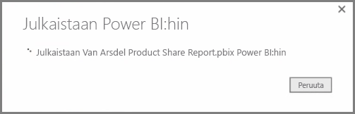
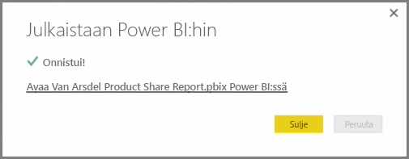
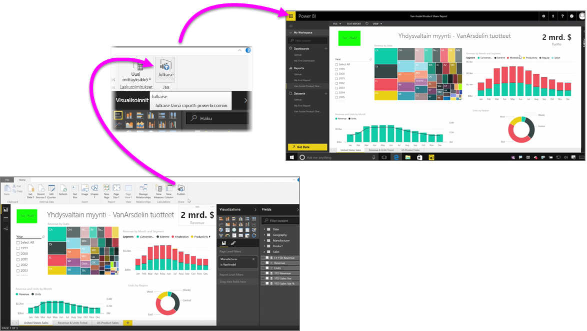

Raporttien julkaiseminen Power BI -palveluun on nopeaa ja helppoa.

Kun olet saanut raporttisi valmiiksi **Power BI Desktopissa**, napsauta **Julkaise**-painiketta Power BI Desktopin **Aloitus**-välilehdellä, niin prosessi alkaa.

Raportti ja tiedot, mukaan lukien visualisoinnit, kyselyt ja mukautetut mitat, pakataan kokonaisuudeksi ja ladataan Power BI -palveluun.

> [!NOTE]
> Power BI Desktop -raportteihin viitataan usein **.pbix**-tiedostoina niiden Windows-tiedostomuodon mukaan.
> 

Kun lataus on valmis, valintaikkunassa ilmoitetaan, että julkaisuprosessi onnistui. Valintaikkunassa on myös linkki, joka avaa raportin suoraan selaimessa Power BI -palvelussa.

Siinä kaikki – raporttien julkaiseminen Power BI Desktopista Power BI -palveluun on helppoa.

