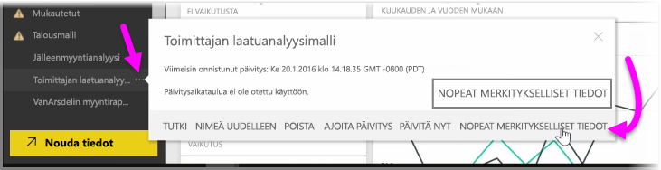
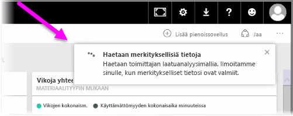
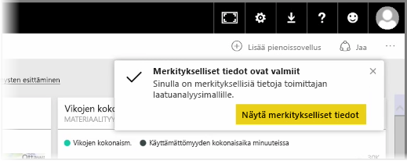
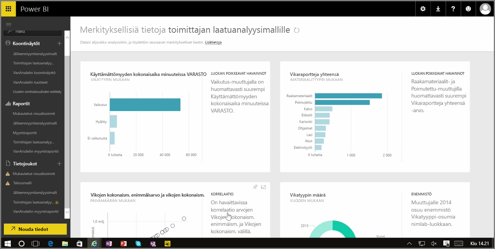

Kun työskentelet Power BI -palvelussa koontinäytön, raportin tai tietojoukon parissa, Power BI voi etsiä niistä nopeita merkityksellisiä tietoja. Napsauta Power BI:ssä vasemmanpuolisen ruudun **Tietojoukot**-osiossa *ellipsikuvaketta* (kolme pistettä) sen tietojoukon vierestä, josta olet kiinnostunut. Esiin tulee valikko, ja oikeassa laidassa näkyy **Nopeat merkitykselliset tiedot** -valinta.

Kun valitset Nopeat merkitykselliset tiedot, Power BI käyttää koneoppimista tietojen hakemiseen ja niiden analysoimiseen niin, että nopeita merkityksellisiä tietoja löytyy. Palvelun oikeassa ylälaidassa näkyy ilmoitus, joka osoittaa Power BI:n etsivän merkityksellisiä tietoja.

Noin viidentoista sekunnin päästä ilmoitus muuttuu osoittamaan, että Power BI löysi merkityksellisiä tietoja.

Kun napsautat ilmoituksessa olevaa **Näytä merkitykselliset tiedot** -painiketta, esiin tulee sivu, jossa on esitettynä visuaalisesti Power BI:n löytämiä merkityksellisiä tietoja samalla tavalla kuin seuraavassa kuvassa. Sivulla on paljon tietoja, joita voi tarkastella vierittämällä.

Nopeat merkitykselliset tiedot -sivulla olevia visualisointeja voi tarkastella ja käyttää tavalliseen tapaan, ja niitä voi myös kiinnittää koontinäyttöihin, tai lisäämällä yhden tai useamman suodattimen voit paljastaa kaikenlaisia uusia tietoja.

**Nopeiden merkityksellisten tietojen** avulla voit antaa Power BI:n paljastaa tiedoista poikkeavat arvot ja yleiset suuntaukset, minkä jälkeen niitä voi käyttää koontinäytöissä. Vaihtoehtoisesti tietoja voi siistiä ja suodattaa edelleen, jotta tärkeimmät merkitykselliset tiedot paljastuvat.

