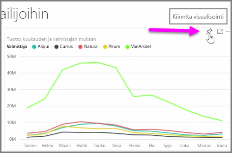
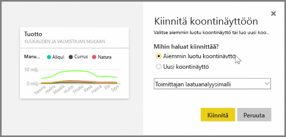
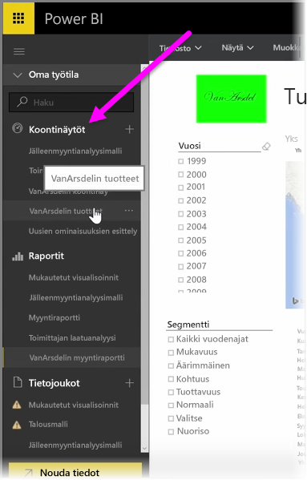
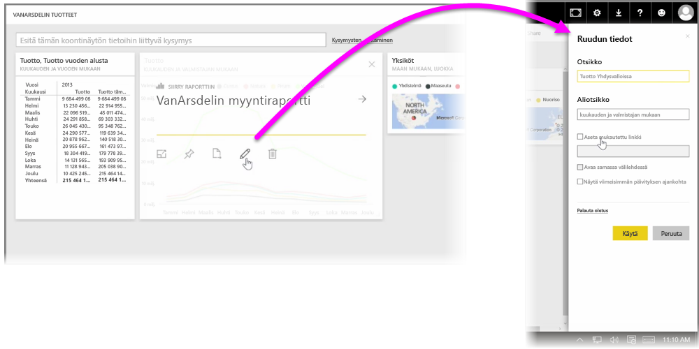

Power BI:n **koontinäytöissä** Power BI -palvelussa luodut tiedot esitetään kootusti visualisointeina. Koontinäyttöjä luodaan **kiinnittämällä** visualisointeja raporteista, jotka olet tehnyt ja julkaissut Power BI Desktopilla. Visualisointeja voi myös luoda Power BI -palvelussa itsessään. Visualisoinnin **kiinnittäminen** koontinäyttöön on sama kuin kiinnittäisi kuvan nastalla ilmoitustauluun – se pysyy valitussa paikassa kaikkien näkyvillä. Kiinnitä visualisointi avaamalla sen raportti Power BI -palvelussa. Osoita sitä visualisointia, jonka haluat kiinnittää, ja napsauta **nastakuvaketta**.

Esiin tulee valintaikkuna, jossa pääset valitsemaan avattavasta valikosta visualisoinnille sopivan koontinäytön tai luomaan uuden koontinäytön. Saat myös esikatselun siitä, miltä kiinnitetty visualisointi näyttää koontinäytössä. Voit kiinnittää samaan koontinäyttöön visualisointeja useista eri raporteista ja sivuista, joten eri tietojoukoista ja lähteistä voi kerätä merkitykselliset tiedot yhdelle sivulle.

**Koontinäytöt**-kohdassa voit lisätä minkälaisia visualisointeja tahansa, esimerkiksi kaavioita, karttoja, kuvia ja muotoja, kiinnittämällä ne. Kun visualisointi on kiinnitettynä koontinäyttöön, sitä kutsutaan **ruuduksi**.

Vanhat ja uudet koontinäyttösi löytyvät Power BI -palvelun vasemmassa laidassa olevasta Koontinäytöt-osasta. Tarkastele haluttua koontinäyttöä valitsemalla se luettelosta.

Voit muuttaa visualisointien asettelua koontinäytöllä oman mielesi mukaan. Muuta ruudun kokoa vetämällä sen kahvoja sisään- tai ulospäin. Siirrä ruutua napsauttamalla ja vetämällä se koontinäytöllä toiseen kohtaan. Osoittamalla ruutua ja napsauttamalla **kynäkuvaketta** saat auki **Ruudun tiedot**, jossa voit muokata **otsikkoa** ja **alaotsikkoa**.

Napsauttamalla koontinäytössä olevaa ruutua voit tarkastella sitä raporttia, josta ruutu on peräisin. Näin voit tarkastella nopeasti niitä tietoja, joihin tietty visualisointi perustuu. Voit myös muuttaa linkkiä käyttämällä **Aseta mukautettu linkki** -kenttää **Ruudun tiedot** -kohdassa.

Voit kiinnittää ruutuja toisesta koontinäytöstä toiseen, jos sinulla on esimerkiksi useita koontinäyttöjä, joista haluat luoda yhteenvedon. Kiinnittäminen toimii samalla tavalla: osoita haluamaasi ruutua ja napsauta **nastakuvaketta**. Koontinäyttöjen luominen ja muokkaaminen on helppoa. Niitä voi myös mukauttaa niin, että saat yksisivuiselle koontinäytölle juuri haluamasi tiedot.

