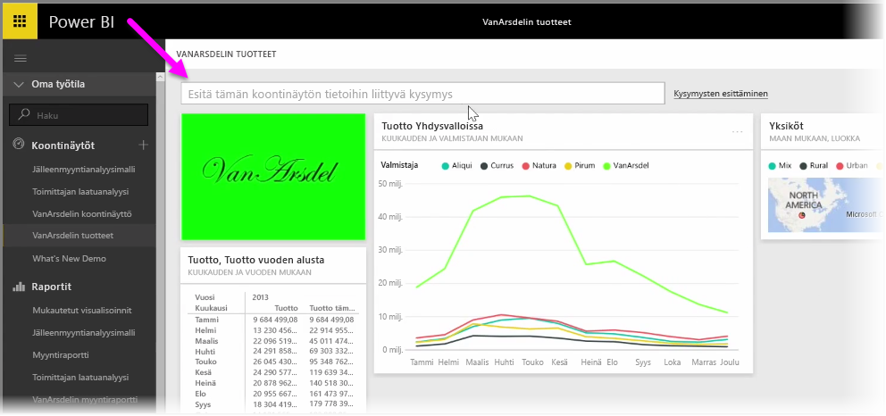
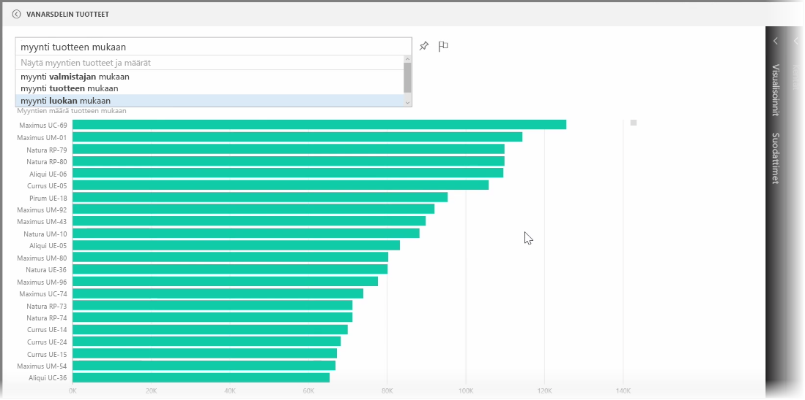

Power BI:ssä on tehokas kielentunnistusmoduuli, jonka avulla voit esittää kysymyksiä tietojoukosta käyttämällä keskustelumaisia ilmaisuja ja kysymyksiä. Näin voit raporttien ja visualisointien lisäksi luoda kaavioita Power BI:n avulla esittämällä yksinkertaisia kysymyksiä.

Voit esittää tiedoista kysymyksiä avaamalla koontinäytön Power BI:ssä. Näytön yläreunassa on syöttöruutu, johon voit kirjoittaa esitettyjä tietoja koskevia kysymyksiä. Tähän viitataan joskus *Kysymykset ja vastaukset* -ominaisuutena, mutta useimmiten puhutaan vain **Q&A**:sta.

Kun valitset ruudun, Power BI näyttää ehdotuksia tietojen perusteella, esimerkiksi ”YTD revenue”. Napsauttamalla ehdotettua termiä esiin tulee tulos, joka esitetään usein yksinkertaisena taulukkona tai korttina. Kun valitset jonkin ehdotetuista aiheista, Power BI luo automaattisesti reaaliaikaisen visualisoinnin valintasi perusteella.

Voit myöt esittää kysymyksiä käyttämällä luonnollista kieltä, esimerkiksi ”What was our revenue last year?” tai ”What product had the highest sales in March 2014?”. (Toimintoa tuetaan tällä hetkellä vain englanniksi.) Power BI näyttää tulkintansa kysymyksestä ja valitsee parhaan visuaalisen tavan vastauksen esittämiseen. Voit **kiinnittää** vastauksen tavalliseen tapaan valitsemaasi koontinäyttöön napsauttamalla **nastakuvaketta**.

Voit missä vaiheessa tahansa muokata visualisointia, joka luotiin luonnollisella kielellä esitetyn kysymyksen tai ilmaisun perusteella. Muokkaus onnistuu näytön oikealla puolella olevista **Visualisoinnit**- ja **Kentät**-ruuduissa. Kaikkien Power BI -visualisointien tapaan voit muuttaa asettelua, säätää suodattimia ja muuttaa kenttien syötteitä.

Kun olet luonut täydellisen visualisoinnin, tallenna se koontinäyttöön napsauttamalla kysymysruudun oikealla puolella olevaa **nastakuvaketta**.

