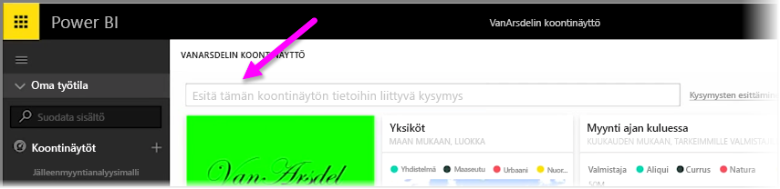
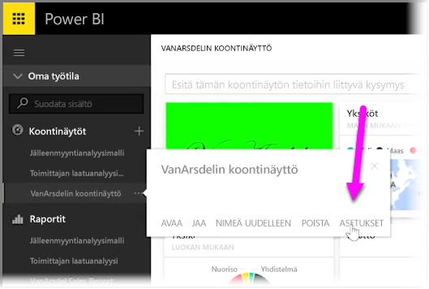
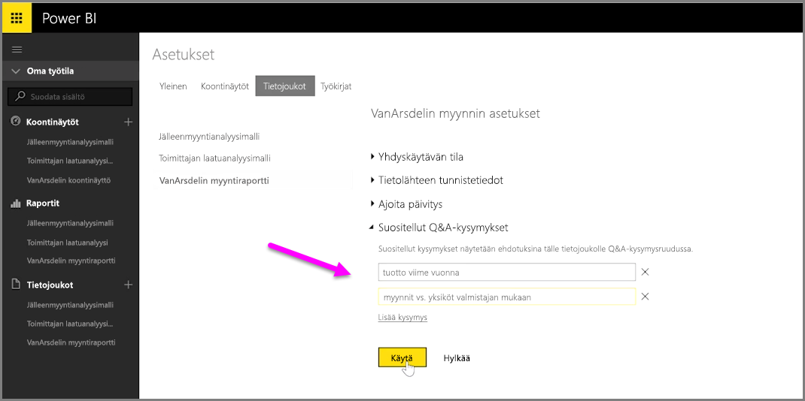

Power BI:n avulla voit lisätä itse ehdottamiasi kysymyksiä toisille käyttäjille, jotka käyttävät luonnollisella kielellä käytettävää koontinäyttöjen kysymysruutua, eli tuttavallisemmin **Q&A**-ruutua. Käyttäjät näkevät näitä ehdotettuja kysymyksiä napsauttaessaan koontinäytön yläreunassa olevaa syöttöruutua.

Lisää omia kysymyksiäsi napsauttamalla haluamasi koontinäytön nimen vieressä olevaa ellipsikuvaketta (kolme pistettä ...) ja valitsemalla valikosta **Asetukset**.

 Tämä avaa koontinäytön **Asetukset**-sivun ja sen pohjana olevat tietojoukot tai työkirjat. Voit poistaa Q&A-hakusyöteruudun kokonaan käytöstä **Koontinäytöt**-osasta **Asetukset**-sivulla, mutta me haluamme nyt lisätä kysymyksiä, joten valitsemme **Tietojoukot**-osan.

**Tietojoukot**-osassa näytetään kaikki koontinäyttöön liittyvät tietojoukot. Valitse koontinäyttöösi liittyvä tietojoukko luettelosta, valitse **Suositellut Q&A-kysymykset** ja valitse sitten **Lisää kysymys** -linkki. Kirjoita kysymys tai kehote syöttöruutuun ja napsauta **Käytä**.

Nyt aina kun joku napsauttaa valitun koontinäytön hakuruutua, hän näkee ehdotuksesi ensimmäisenä kehoteluettelossa, ja ehdottamasi kysymyksen valitseminen vie hänet suoraan Q&A-vastaukseen. Tämä on arvokas tapa saada koontinäyttöjen käyttäjät ajattelemaan käytettävissä olevia tietoja ja sitä, miten he voisivat käyttää sitä parhaalla tavalla.

