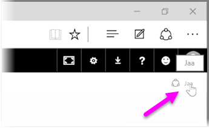
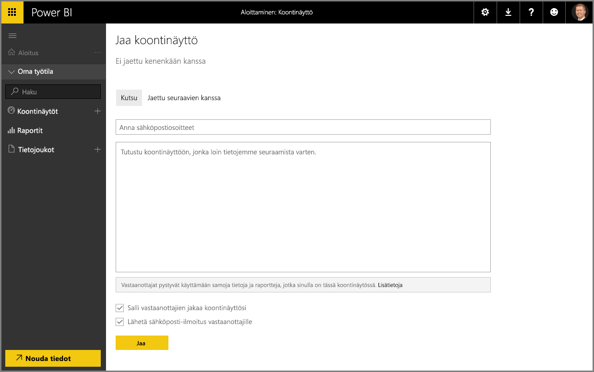

Olemme jo nähneet, miten Power BI auttaa löytämään tietoja, keräämään ne tietomalliksi ja rakentamaan tiedoista raportteja ja visualisointeja. Olemme myös nähneet, miten näitä raportteja voi julkaista Power BI -palveluun ja miten voidaan luoda koontinäyttöjä, jotka auttavat valvomaan tietoja ajan kuluessa. Kaikki nämä ominaisuudet ovat vielä tehokkaampia, kun jaat merkitykselliset tiedot toisten kanssa organisaatiossasi. Onneksi koontinäyttöjen jakaminen on helppoa.

Voit jakaa koontinäytön avaamalla sen Power BI -palvelussa ja valitsemalla **Jaa**-linkki oikeasta yläkulmasta.

Esiin tulee **Jaa koontinäyttö** -sivu, jossa voit valita **Kutsu**-osan ja lisätä sitten **Sähköpostiosoite**-syöttöruutuun ne henkilöt, joille haluat antaa oikeuden käyttää koontinäyttöäsi. Kirjoittaessasi sähköpostiosoitteita Power BI vertaa niitä oman toimialueesi ja Office 365 -toimialueen tileihin ja täydentää osoitteet automaattisesti mahdollisuuksien mukaan. Voit myös kopioida ja liittää sähköpostiosoitteita tähän ruutuun tai lisätä useita henkilöitä kerralla jakeluluettelon, käyttöoikeusryhmän tai Office 365 -ryhmän avulla.

Jos valitsit (alareunan lähellä olevan) *Lähetä sähköposti-ilmoitus vastaanottajille* -valintaruudun, vastaanottajat saavat sähköpostin, jossa on linkki koontinäyttöön ja ilmoitus koontinäytön jakamisesta vastaanottajien kanssa. Voit lisätä lähetettävään sähköpostiin oman viestisi tai lähettää Power BI:n luoman viestin (joka löytyy suoraan sähköpostikentän alla olevasta ruudusta).

>[!NOTE]
>Vastaanottajat, joilla ei ole Power BI -tiliä, ohjataan suorittamaan rekisteröitymisprosessi ennen kuin he pääsevät tarkastelemaan koontinäyttöäsi.
> 
> 

Kaikki, joiden kanssa jaat koontinäyttösi, voivat nähdä ja käyttää koontinäyttöä samalla tavalla kuin sinäkin. Heillä on kuitenkin *vain luku* -oikeudet pohjana oleviin raportteihin ja *ei käyttöoikeutta* pohjana oleviin tietojoukkoihin.

Voit myös valita Jaa koontinäyttö -sivulta **Jaettu seuraavien kanssa** -välilehden, niin näet, kenen kanssa olet jakanut tämän koontinäytön aiemmin.

