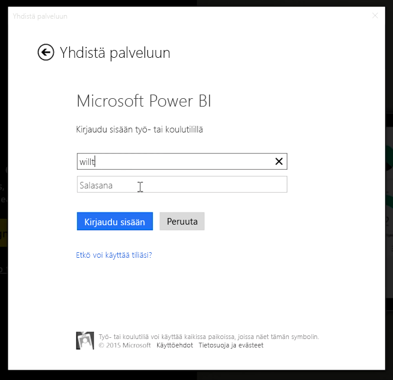
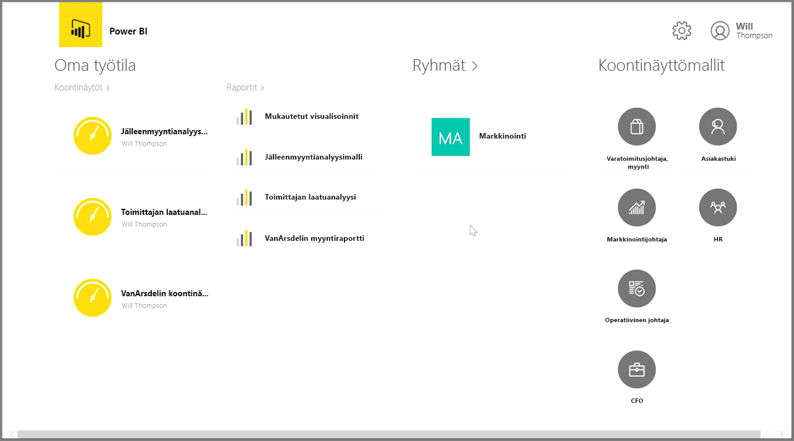
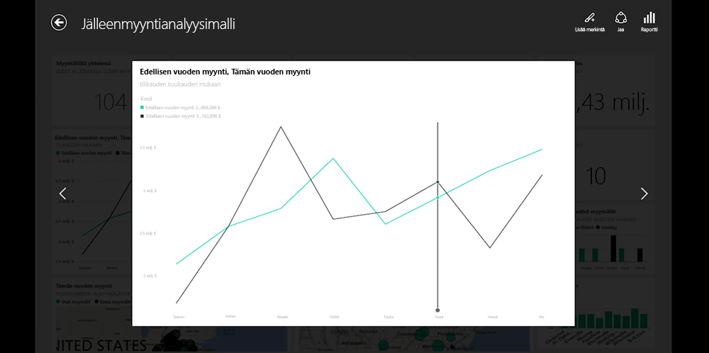
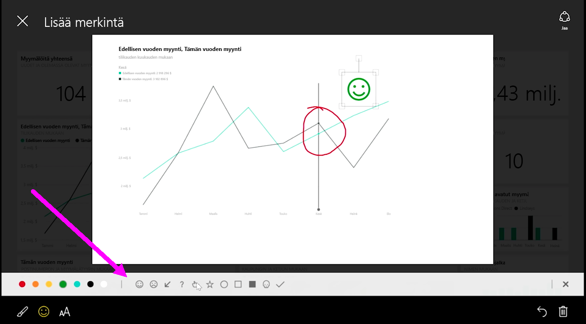

Jos haluat pitää kirjaa tiedoistasi matkan päältä, voit käyttää iOS-, Android- ja Windows-laitteiden Power BI-mobiilisovelluksia.

Kun käytät Power BI -sovellusta, kirjaudu ensin sisään käyttäen Power BI -palvelun tiliäsi. Windows-mobiililaitteella (tässä tapauksessa tabletilla) kirjautuminen näyttää seuraavalta.

Ensimmäisessä esiin tulevassa näytössä on kaikki käytössäsi oleva sisältö, mukaan lukien raportit, koontinäytöt ja ryhmät. Sovelluksessa on myös mallikoontinäyttöjä, joita voi käyttää inspiraationa tai vain esimerkkeinä Power BI:n ominaisuuksista. Sovellus on suunniteltu tukemaan kosketustoimintoja: napauttamalla koontinäyttöä tai raporttia voit tarkastella sitä koko näytön tilassa ja vierittää sitä sormella.

Voit avata minkä tahansa koontinäytön napauttamalla sitä. Koontinäytössä voit napauttaa koontinäytön ruutua ja tarkastella sitä suuremmassa näkymässä.

Voit myös lisätä huomautuksia löytämiisi merkityksellisiin tietoihin napauttamalla oikeassa yläkulmassa olevaa **Huomautus**-painiketta. Näin voit korostaa tiettyjä kiinnostavia alueita kohdistetuissa ruuduissa. Huomautustyökalut löytyvät näytön alareunasta.

Jaa huomautuksin merkitty ruutu napauttamalla oikeassa yläkulmassa olevaa **Jaa**-linkkiä.

Napauttamalla oikeassa yläkulmassa olevaa **Raportti**-linkkiä voit tarkastella ruudun pohjana olevia tietoja. Näin saat näkyviin tarkalleen samat visualisoinnit kuin verkkoselaimessa tai Power BI Desktopissa ja voit käyttää raporttia napauttamalla palkkeja, porautumalla tai käyttämällä osittajia.

