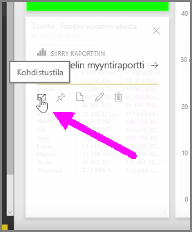
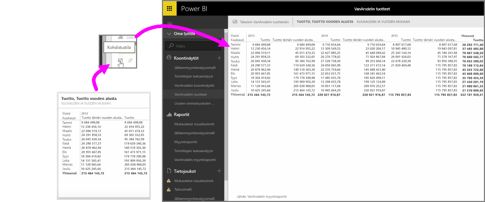

Joskus Power BI -palvelussa koontinäyttöjä tai raportteja tarkastellessa voi olla hyödyllistä keskittyä yksittäiseen kaavioon tai visualisointiin. Sen voi tehdä kahdella eri tavalla.

Koontinäytössä ollessasi osoita jotakin ruutua, niin oikeaan yläkulmaan tulee näkyviin kuvakevalintoja. Napsauttamalla ellipsikuvaketta (kolme pistettä) näet kuvakkeita, jotka edustavat erilaisia ruudulle tehtäviä toimia.

Vasemmalla on **Kohdistustila**. Napsauttamalla sen kuvaketta voit laajentaa ruudun kattamaan koko koontinäytön alueen.

**Kohdistustilan** avulla näet visualisoinneista ja niiden selitteistä paljon enemmän. Kun esimerkiksi muutat ruudun kokoa Power BI:ssä, joitain pylväitä ei välttämättä näytetä, sillä ruudussa ei ole tarpeeksi tilaa.

**Kohdistustilassa** kaikki tiedot ovat näkyvillä. Voit myös kiinnittää visualisoinnin suoraan Kohdistustilassa toiseen koontinäyttöön napsauttamalla **nastakuvaketta**. Poistu **Kohdistustilasta** napsauttamalla **Kohdistustilan** vasemmassa yläkulmassa olevaa **Takaisin kohteeseen...**-kuvaketta.

Prosessi on samankaltainen kuin raportin tarkastelu. Osoittamalla visualisointia voit nähdä vasemmassa yläkulmassa olevat kolme kuvaketta ja valita **Kohdistustila**-kuvakkeen. Kun kuvake valitaan, visualisointi laajentuu kattamaan koko raporttipohjan. Visualisointi on tässä tilassa edelleen vuorovaikutteinen, mutta visualisointien välinen ristisuodatustehoste menetetään tilapäisesti.

Palaa edelliseen näkymään osoittamalla laajennettua ruutua tai raporttia ja napsauttamalla vasemmassa yläkulmassa olevaa vasemmalle osoittavaa **Takaisin kohteeseen...**-kuvaketta.

