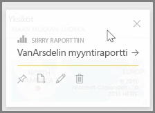
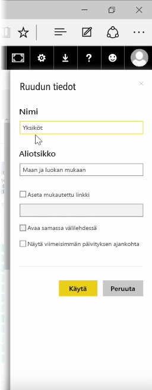
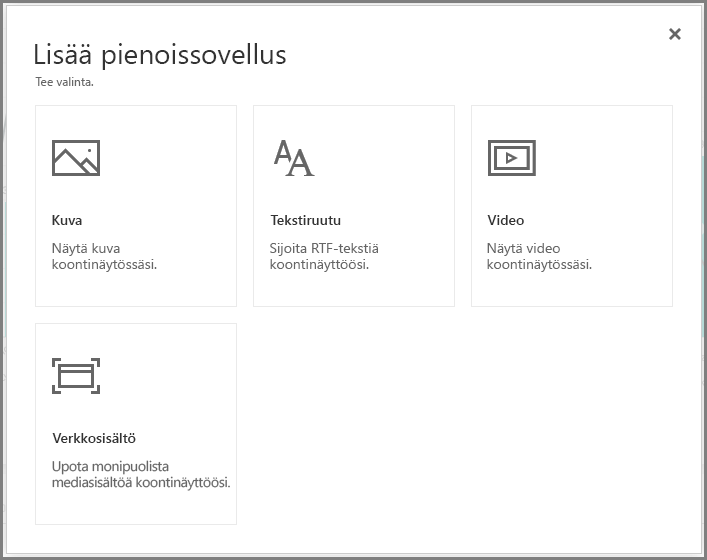
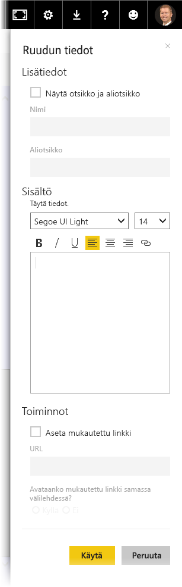

Kun olet muodostanut koontinäytön, voit muokata sen **Ruutuja* Power BI-palvelussa ja muuttaa sen muotoilua.

Muokkaa ruutua osoittamalla sitä ja napsauttamalla ellipsikuvaketta (kolme pistettä), niin esiin tulee erilaisia kuvakkeita, joiden avulla ruutua voi muokata.

Napsauttamalla **kynäkuvaketta** voit avata **Ruudun tiedot** -ruudun. Tässä ruudussa voit muuttaa ruudun **Otsikon**, **Alaotsikon**, lisätä viimeisimmän päivityksen ajan sekä muita tietoja, kuten mukautetun linkin.

Oletusarvona koontinäytössä olevaa ruutua napsauttamalla pääsee siihen raporttiin, johon ruutu perustuu. Muuta tätä toimintoa käyttämällä **Aseta mukautettu linkki** -kenttää **Ruudun tiedot** -ruudussa. Yksi suosittu tapa käyttää tätä ominaisuutta on ohjata käyttäjät organisaation kotisivulle, kun logoa napsautetaan.

## Pienoissovellusten lisääminen koontinäyttöön
Voit lisätä koontinäyttöön myös pienoissovelluksia. **Pienoissovellus** on erityinen koontinäytön ruutu, joka ei sisällä visualisointia vaan muita kohteita, kuten kuvan, online-videon, tekstiruudun tai monipuolista verkkosisältöä.

Kun valitset koontinäytön oikeassa yläkulmassa olevan Lisää pienoissovellus -linkin, esiin tulee **Lisää pienoissovellus** -valintaikkuna.

Kun esimerkiksi lisäät tekstiä ruutuun, oikealle puolelle tulee näkyviin **Ruudun tiedot** -ruutu, jossa voit muokata ruudun tietoja samankaltaisesti kuin minkä tahansa ruudun tietoja muokatessa. Kun kyseessä on pienoissovellus, valittavana on myös osio, jossa voidaan määrittää tai muokata pienoissovelluksen sisältöä, esimerkiksi tekstiruudun tekstimuotoilueditori.

Käyttämällä pienoissovelluksia ja muokkaamalla ruutujen tietoja voit mukauttaa koontinäyttösi juuri sellaiseksi kuin haluat.

