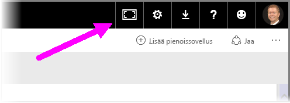
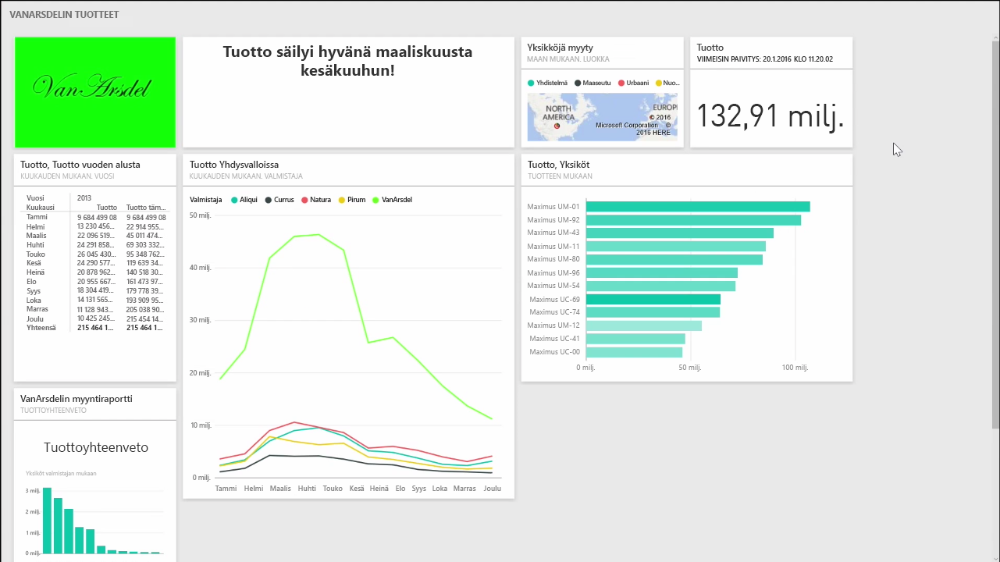
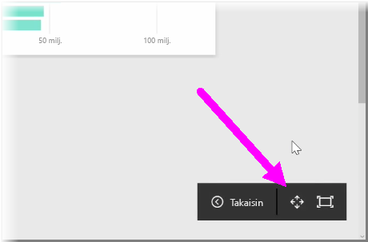
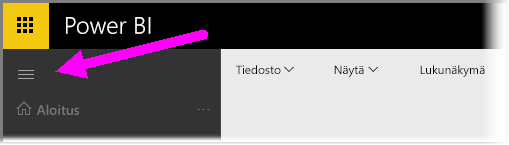

Joskus koontinäyttöjä luodessa voi huomata, että sisältöä on enemmän kuin koontinäyttöön mahtuu. Koontinäytön näyttämistä voi hallita muutamalla eri ratkaisulla, jotta koontinäytön koko sisältö voidaan saada esiin.

Helpoin tapa koko koontinäytön näyttämiseen samalla näytöllä on napsauttaa koontinäytön oikeassa yläkulmassa olevaa **Koko näytön tila** -painiketta.

**Koko näytön tila** -painikkeen napsauttaminen siirtää selaimen koko näytön tilaan poistaen kaikki elementit koontinäytön ympäriltä ja suurentaen siten tarkasteltavaa tilaa.

Valitsemalla **Koko näytön tilassa** **Sovita näyttöön** -valinnan voit kutistaa kaikki ruudut mahtumaan samaan näyttöön niin, että näyttöä ei tarvitse vierittää. Tätä kutsutaan yleisesti *TV-tilaksi*, ja se on hyödyllinen, kun koontinäyttöä käytetään esitelmässä tai esitellään julkisessa tilassa olevalla näytöllä.

Toinen tapa hallita koontinäyttöjen tilankäyttöä on kutistaa sivun vasemmalla puolella oleva siirtymisruutu napsauttamalla hampurilaiskuvaketta. Laajenna siirtymisruutu napsauttamalla kuvaketta uudelleen.

Voit taata, että koontinäytön siirtymisruutu on aina kutistettuna liittämällä URL-osoitteeseen seuraavan loppuosan:

> ?collapseNavigation=true
> 
> 

Käyttämällä tätä linkkiä koontinäyttö avautuu siten, että siirtymisruutu on kutistettuna.

