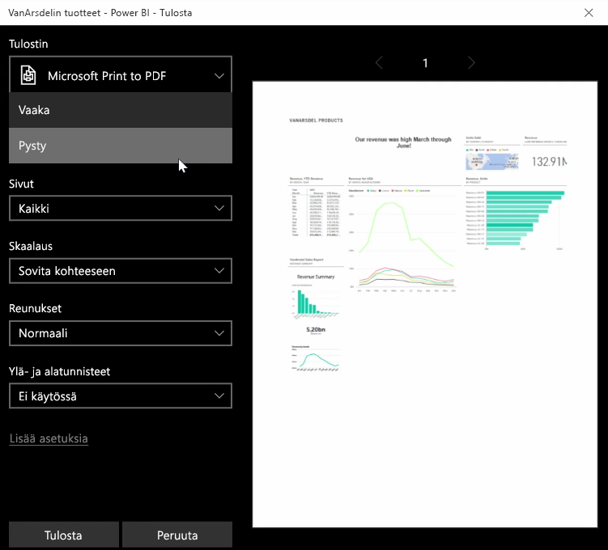

Joskus raportin tai koontinäytön sisällön haluaa ottaa mukaan kokoukseen tai muiden kanssa jaettavaksi. Power BI:n avulla visualisoinneista voi tehdä tulosteita muutamalla tavalla.

Napsauta Power BI -palvelun oikeasta yläkulmasta ellipsikuvaketta (kolme pistettä) ja valitse **Tulosta koontinäyttö**.

Esiin tulee **Tulosta**-valintaikkuna, jossa voit valita käytettävän tulostimen sekä tavanomaiset tulostusasetukset kuten *pysty*- tai *vaaka*suunnan.

## Tietojen vieminen visualisoinnista
Voit myös viedä tietoja Power BI -palvelussa olevasta visualisoinnista. Napsauta minkä tahansa visualisoinnin ellipsikuvaketta ja napsauta sitten (keskimmäistä) **Vie tiedot** -painiketta. Kun tämä tehdään, paikalliselle tietokoneelle luodaan ja ladataan .CSV-tiedosto ja selaimeen tulee viesti, joka ilmoittaa latauksen valmistuneen (kuten kaikkien selaimessa käynnistettyjen latausten yhteydessä).

Voit myös tulostaa tai viedä tietoja suoraan raportista. Kun raporttia tarkastellaan Power BI -palvelussa, avaa tulostusikkuna valitsemalla **Tiedosto > Tulosta**.

Raporteista voi viedä tietoja samalla tavalla kuin koontinäytöistä valitsemalla visualisoinnin vientipainikkeen.

