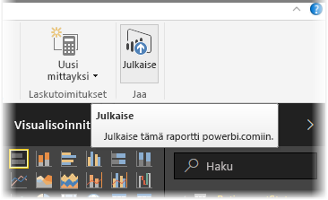
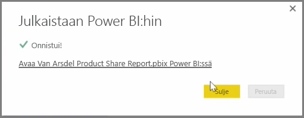

Voit päivittää raportteja ja tietojoukkoja, jotka olet jo julkaissut Power BI Desktopista Power BI -palveluun. Sen voi tehdä valitsemalla **Julkaise** valintanauhan **Aloitus**välilehdellä.

Kun julkaiset raportin, joka on jo Power BI palvelussa, sinua pyydetään vahvistamaan, että haluat korvata aiemman tietojoukon ja raportit juuri päivittämälläsi versiolla.

Kun valitset **Korvaa**, Power BI:ssä olevat tietojoukot ja raportit korvataan niillä tietojoukoilla ja raporteilla, jotka ovat tiedoston uusimmassa Power BI Desktop -versiossa.

Kaikkien Power BI Desktopin **Julkaisu**tapahtumien tavoin esiin tulee valintaikkuna, joka ilmoittaa julkaisutapahtuman onnistuneen, ja saat linkin Power BI -palvelussa olevaan raporttiin.

Tällä tavalla tietoja voi päivittää manuaalisesti. Tietojoukkoja ja raportteja voi myös päivittää automaattisesti; se prosessi käsitellään toisessa oppimisaiheessa.

