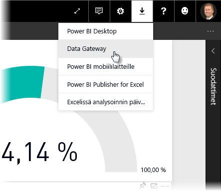
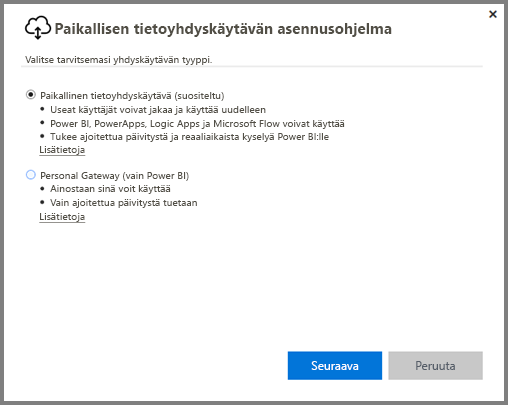
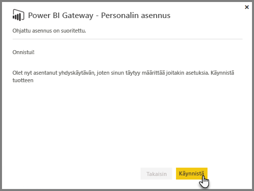
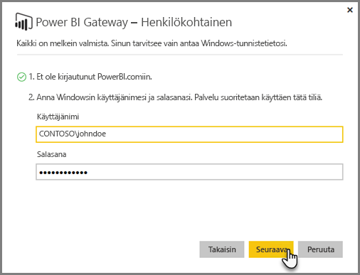
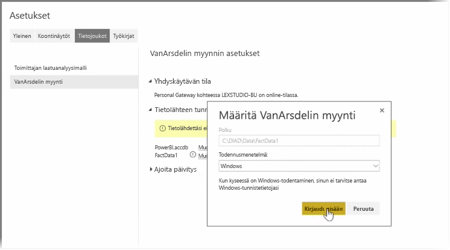
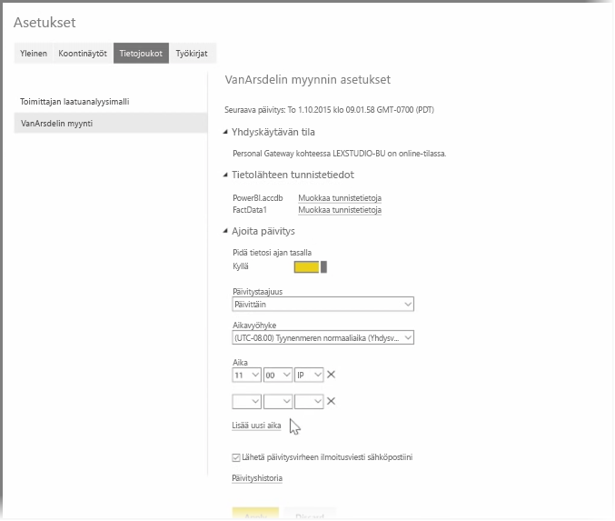

Edellisissä aiheissa on tarkasteltu, miten Power BI:tä voidaan käyttää tietolähteisiin yhdistämiseen ja miten Power BI -palvelussa olevia tietojoukkoja voi päivittää manuaalisesti. Tietojen päivittäminen jokaisen muutoksen jälkeen ei kuitenkaan ole käytännöllistä, joten voit määrittää Power BI:n suorittamaan ajoitetun päivityksen, joka muodostaa yhteyden tietolähteisiin ja julkaisee ne automaattisesti Power BI -palveluun. Tällä tavalla palvelu voidaan myös yhdistää kaikenlaisiin paikallisiin tietolähteisiin, kuten Excel-tiedostoihin, Access-tietokantoihin, SQL-tietokantoihin ja muihin kohteisiin.

Paikalliset tietolähteet yhdistetään Power BI -palveluun **tietoyhdyskäytävällä**. Tietoyhdyskäytävä on pieni sovellus, joka suoritetaan tietokoneella ja joka käyttää valmista aikataulua tietoihin yhdistämiseen, päivitysten keräämiseen ja niiden päivittämiseen Power BI -palveluun. **Henkilökohtainen yhdyskäyttävä** on **tietoyhdyskäytävä**, jota voidaan käyttää ilman järjestelmänvalvojamääritystä.

>[!NOTE]
>Henkilökohtaista Power BI -yhdyskäytävää suorittavan tietokoneen *täytyy* olla käynnissä ja yhteydessä Internetiin, jotta **henkilökohtainen yhdyskäytävä** toimisi oikein.
> 

Määritä **henkilökohtainen yhdyskäytävä** kirjautumalla ensin Power BI -palveluun. Napsauta näytön oikeassa yläkulmassa olevaa **Lataus**-kuvaketta ja valitse sitten valikosta **Tietoyhdyskäytävät**.

Sieltä sinut viedään verkkosivulle, jossa voit valita **Power BI -yhdyskäytävä – henkilökohtainen** -valinnan alla kuvatulla tavalla.

Suorita sovellus, kun se on latautunut, ja suorita ohjattu asennus loppuun.

Sen jälkeen sinua kehotetaan käynnistämään ohjattu määritys yhdyskäytävän määritystä varten.

Sinua pyydetään ensin kirjautumaan Power BI -palvelun tilille ja sitten koneen Windows-tilille, sillä yhdyskäytäväpalvelu toimii tilin alaisuudessa.

Palaa Power BI -palveluun. Avaa päivitettävän tietojoukon vieressä olevasta ellipsikuvakkeesta (kolmesta pisteestä) valikko ja valitse sitten **Ajoita päivitys**. Tämä avaa **Päivitysasetukset** -sivun. Power BI havaitsee, että olet asentanut **henkilökohtaisen yhdyskäytävän** ja kertoo sen tilan.

Valitse asianmukaisen tietolähteen vierestä **Muokkaa tunnistetietoja** ja määritä todentaminen.

Ota lopuksi automaattiset päivitykset käyttöön **Ajoita päivitys** -kohdan asetuksista ja määritä milloin ja kuinka usein päivitykset suoritetaan.

Siinä kaikki. Power BI päivittää raportit ja tietojoukot tietolähteistä määritetyn aikataulun mukaan käyttämällä annettuja tunnistetietoja ja yhteyttä siihen tietokoneeseen, jossa **henkilökohtainen yhdyskäytävä** on käynnissä. Kun menet Power BI:hin seuraavan kerran, koontinäytöt, raportit ja tietojoukot kuvastavat viimeisimmän ajoitetun päivityksen tietoja.

## Seuraavat vaiheet
**Onnittelut!** Olet nyt suorittanut tämän **Tietojen tutkiminen** -osion Power BI:n **Ohjattu oppiminen** -kurssista. Power BI on täynnä kiinnostavia tapoja tutkia tietoja, jakaa merkityksellisiä tietoja ja käyttää visualisointeja. Kaikki toiminnot ovat käytettävissä selaimella palvelussa, johon voi muodostaa yhteyden mistä vain.

**Excel** on yksi Power BI:n tehokkaista ja tunnetuista kumppaneista. Power BI ja Excel on suunniteltu toimimaan hyvin yhdessä; työkirjat sopivat erinomaisesti Power BI:hin, ja niiden tuominen Power BI:hin on helppoa.

Kuinka helppoa? Se selviää seuraavassa **Power BI ja Excel** -osiossa.

Nähdään seuraavassa osiossa!

