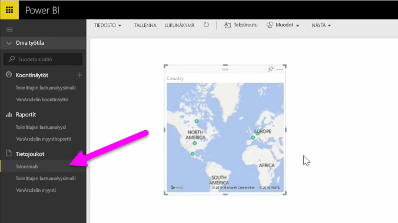

Tässä aiheessa tarkastellaan ensin sitä, miten Power BI:ihn voidaan tuoda yksinkertainen **taulukko** paikallisessa asemassa sijaitsevasta Excel-työkirjatiedostosta. Opit myös, miten voit aloittaa taulukon tietoja tarkastelemisen Power BI:ssä luomalla raportin.

## Varmista tietojen taulukoksi muotoileminen
Jotta Power BI voi tuoda tietoja työkirjasta, tiedot on **muotoiltava taulukoksi**. Se on helppoa. Excelissä voit korostaa tietyt solut ja valita sitten Excelin **Lisää**-valintanauhalla **Taulukko**.

Kannattaa varmistaa, että kaikilla sarakkeilla on hyvä nimi. Siten haluttujen tietojen löytäminen on helpompaa, kun raportteja luodaan Power BI:ssä.

## Paikallisen aseman tuominen
Missä säilytätkään tiedostojasi, niiden tuominen on helppoa Power BI:n avulla. Siirtymällä Power BI:ssä kohtaan **Nouda tiedot** > **Tiedostot** > **Paikalliset tiedostot** voit hakea ja valita halutun Excel-tiedoston.

Kun tiedosto on tuotu Power BI:hin, voit aloittaa raporttien luomisen.

Tiedostojen ei tietenkään tarvitse olla paikallisessa asemassa. On vielä parempi, jos tallennat tiedostot OneDriveen tai SharePoint-ryhmäsivustoon. Käsitellään sitä tarkemmin myöhemmin tässä aiheessa.

## Raporttien luomisen aloittaminen
Kun työkirjan tiedot on tuotu, Power BI:hin luodaan tietojoukko. Se lisätään **Tietojoukot**-kohtaan. Nyt voit aloittaa tietojen tutkimisen luomalla raportteja ja koontinäyttöjä. Napsauta vain tietojoukon vieressä olevaa **Avaa valikko** -kuvaketta ja valitse sitten **Tutustu**. Uusi tyhjä raporttipohja tulee esiin. Oikealla puolella **Kentät**-kohdassa on taulukot ja sarakkeet. Valitse ne kentät, joista haluat luoda uuden visualisoinnin pohjalle.

Voit muuttaa visualisoinnin tyyppiä ja lisätä **suodattimia** ja muita ominaisuuksia **Visualisoinnit**-kohdassa.

