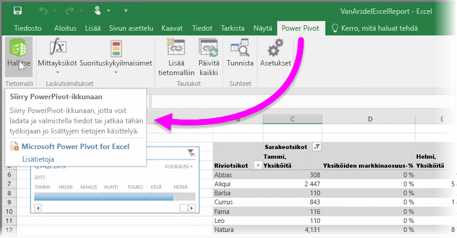
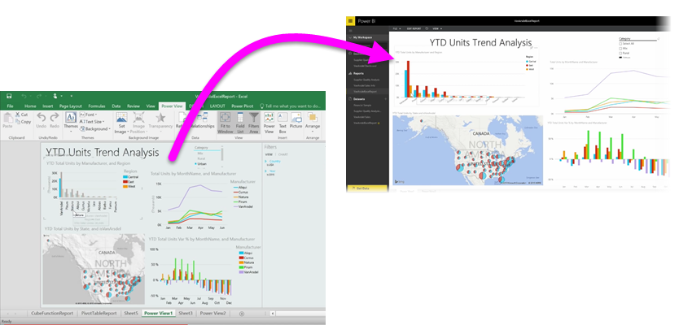

Jos käytät Excelin edistyneitä BI-ominaisuuksia, kuten **Power Queryä** (nimellä **Get & Transform** Excel 2016:ssa) tietojen hakemiseen ja lataamiseen, **Power Pivotia** tehokkaiden tietomallien luomiseen ja **Power Wiev’tä** dynaamisten raporttien luomiseen, voit tuoda nekin Power BI:hin.

Jos käytät **Power Pivotia** sellaisten edistyneiden tietomallien luomiseen, joissa on useita liittyviä taulukoita, mittoja, laskettuja sarakkeita ja hierarkioita, Power BI tuo myös kaikki ne tiedot.

Jos työkirjassa on **Power View -taulukoita**, ei hätää. Power BI luo ne uudelleen uusina **Raportteina** Power BI:ssä. Voit aloittaa visualisointien kiinnittämisen koontinäyttöihin heti.

Yhtenä Power BI:n mahtavista ominaisuuksista Power Queryllä tai Power Pivotilla ulkoisesta tietolähteestä yhdistetyt, haetut ja ladatut tiedot voidaan **päivittää ajoitetusti**, kun työkirja on tuotu Power BI:hin. Käyttämällä ajoitettua päivitystä Power BI hyödyntää työkirjan yhteystietoja suoraan tietolähteeseen yhdistämiseen ja kaikkien muuttuneiden tietojen hakemiseen ja lataamiseen. Kaikki raporttien visualisoinnit päivitetään myös automaattisesti.

