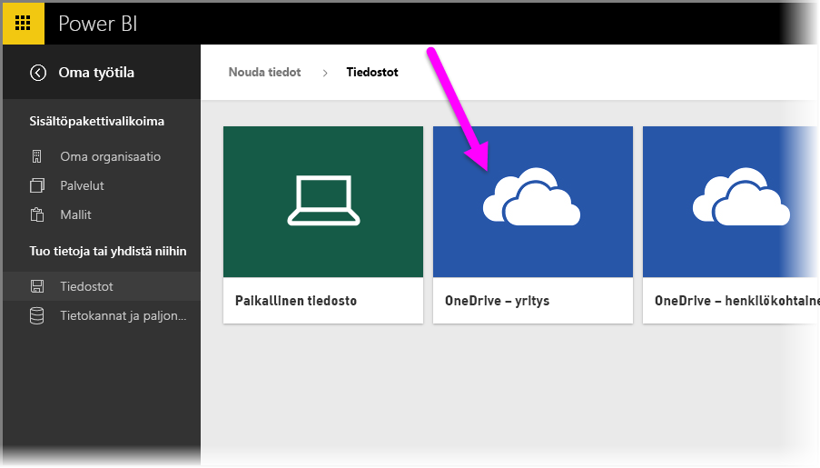
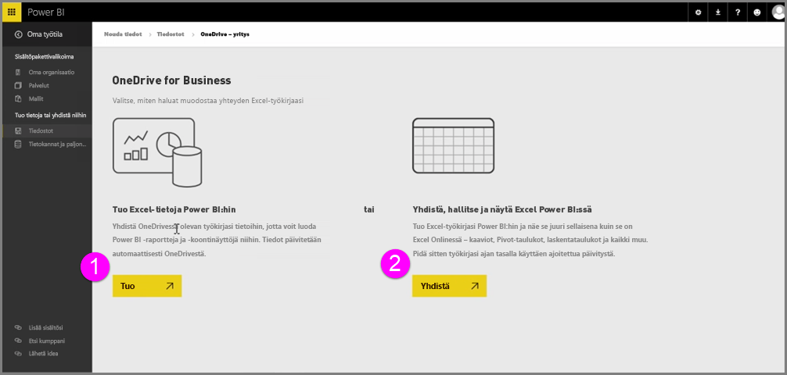
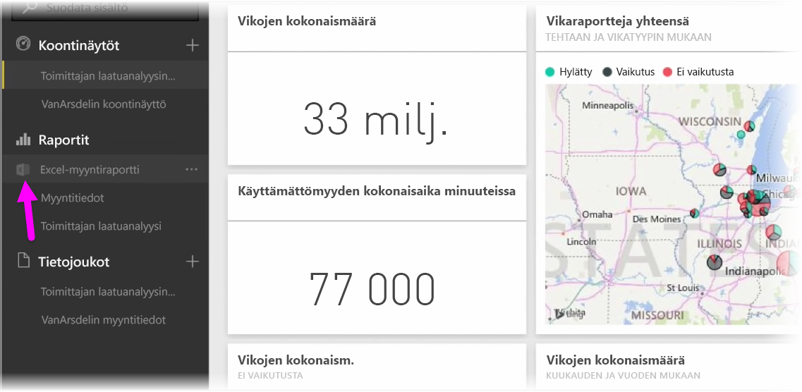
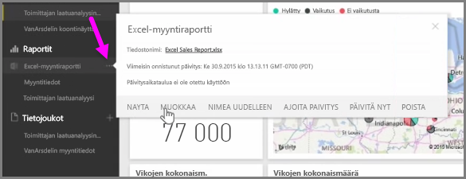

Kun tallennat Excel-työkirjasi OneDriveen, voit integroida Power BI:n ja Excelin saumattomasti.

Koska OneDrive on pilvipalvelu kuten Power BI, niiden välille voidaan muodostaa reaaliaikainen yhteys. Kun teet muutoksia työkirjaan OneDrivessa, tekemäsi muutokset *synkronoidaan automaattisesti* Power BI:hin. Tällä tavalla raporttiesi ja koontinäyttöjesi visualisoinnit pysyvät ajan tasalla. Jos työkirjasi on yhdistetty ulkoisiin tietolähteisiin, esimerkiksi tietokantaan tai OData-syötteeseen, voit tarkistaa päivitysten saatavuuden Power BI:n **Ajoita päivitys** -toiminnoilla. Haluatko esittää kysymyksiä työkirjasi tietoihin liittyen? Se onnistuu helposti. Power BI:n **kysymys- ja vastaustoiminnoilla** tämä onnistuu helposti.

Voit yhdistää Excel-tiedostosi OneDrive for Businessiin kahdella tavalla:

1. Excel-tietojen tuominen Power BI:hin
2. Voit yhdistää, hallita ja näyttää Excel-tietoja Power BI:ssä.

### Excel-tietojen tuominen Power BI:hin
Kun tuot Excel-tiedot Power BI:hin, työkirjasi taulukkotiedot ladataan uuteen tietojoukkoon Power BI:ssä. Jos sinulla on työkirjassasi **Power View** -välilehtiä, myös ne tuodaan ja niistä luodaan uudet raportit Power BI:ssä.

Power BI säilyttää yhteyden OneDrive for Businessiin tallennettuun työkirjatiedostoosi. Jos teet muutoksia työkirjaasi ja tallennat ne, muutokset *synkronoidaan automaattisesti** Power BI:hin, yleensä tunnin kuluessa. Jos työkirjasi on yhdistetty ulkoisiin tietolähteisiin, voit määrittää ajoitetut päivitykset, jotka pitävät Power BI:n tietojoukkosi ajan tasalla. Koska Power BI:n raporttien ja koontinäyttöjen visualisoinnit käyttävät tietojoukon tietoja, kyselyt suoritetaan salamannopeasti analysoidessasi ja käyttäessäsi tietoja.

### Excel-tietojen yhdistäminen, hallitseminen ja näyttäminen Power BI:ssä
Kun yhdistät Excel-työkirjan, voit käyttää työkirjaasi saumattomasti sekä Excelissä että Power BI:ssä. Kun yhdistät tällä tavalla, työkirjan raportin vieressä näytetään pieni Excel-kuvake.

Näet raportissa Excel-työkirjasi Power BI:ssä aivan samalla tavalla kuin **Excel Onlinessa**. Voit tarkastella ja muokata taulukkovälilehtiä Excel Onlinessa valitsemalla kolmen pisteen valikosta Muokkaa. Kun teet muutoksia, kaikki koontinäyttöihin kiinnittämäsi visualisoinnit päivitetään automaattisesti.

Power BI:ssä ei luoda mitään tietojoukkoja. Kaikki tiedot pysyvät OneDriveen tallennetussa työkirjassa. Eräs tämän tavan monista eduista on se, että voit määrittää **ajoitetut päivitykset**, jos työkirjasi on yhdistetty ulkoisiin tietolähteisiin. Voit valita elementtejä (esimerkiksi Pivot-taulukoita ja kaavioita) sekä **kiinnittää** niitä suoraan koontinäyttöihin Power BI:ssä. Jos teet muutoksia, ne päivitetään automaattisesti myös Power BI:ssä. Lisäksi Power BI:n mahtavilla **kysymys- ja vastaustoiminnoilla** voit kysyä kysymyksiä työkirjan tietoihin liittyen.  

