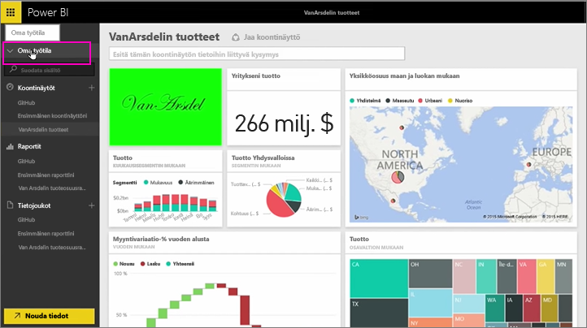
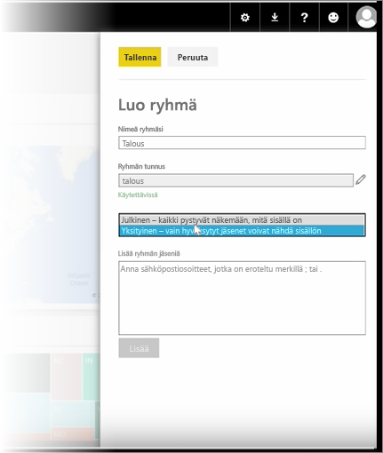
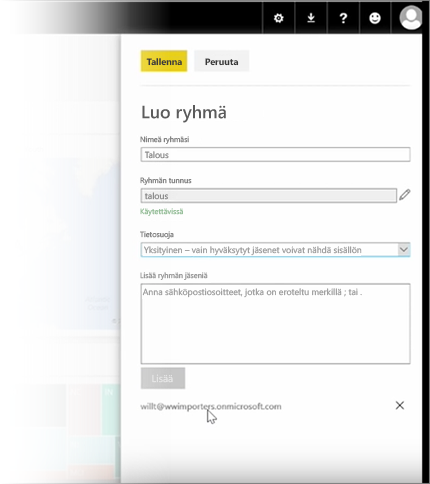

Tällä oppitunnilla luomme ensin *ryhmän*. **Ryhmä** määrittää käyttäjät, joilla on käyttöoikeudet tiettyihin koontinäyttöihin, raportteihin ja tietoihin.

Power BI:n ryhmät perustuvat Office 365:n ryhmiin. Jos olet siis hallinnut ryhmäsi sähköpostia, kalenteria ja tiedostoja Office 365 -ryhmillä, huomaat, että Power BI tarjoaa samat toiminnot – ja paljon muutakin. Kun käytät ryhmää Power BI:ssä, luot itse asiassa Office 365 -ryhmän.

Tässä esimerkissä luomme uuden rahoitusryhmän. Näytämme, miten ryhmä luodaan, miten koontinäytöt, raportit ja tietojoukot jaetaan ryhmässä ja miten voit lisätä jäseniä, jotka saavat käyttöoikeudet ryhmän kohteisiin.

Aloitan täältä omasta työtilastani. Täällä on koontinäyttöjä, raportteja ja tietojoukkoja, jotka olen luonut itse tai jotka muut ovat jakaneet kanssani.

Kun laajennan oman työtilani, voin valita **Luo ryhmä**.

Täällä voin antaa nimen. Tässä esimerkissä luomme rahoitusryhmän, joten annan sille nimeksi Rahoitus. Power BI tarkistaa, ettei nimeä ole olemassa toimialueella.

Voin määrittää tietosuojatason valitsemalla, näkevätkö kaikki organisaationi käyttäjät ryhmän sisällön vai näkevätkö sen vain ryhmän jäsenet.

Kirjoitan tänne sähköpostiosoitteet, käyttöoikeusryhmät ja jakeluluettelot. Teen heistä ryhmän jäseniä valitsemalla **Lisää**. Sitten tallennan ryhmän.

Nyt on aika siirtyä seuraavan oppitunnin pariin!

