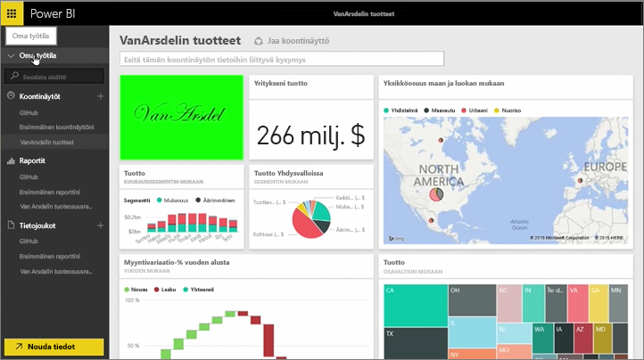
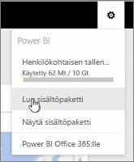
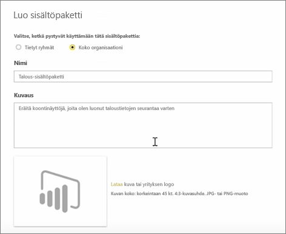
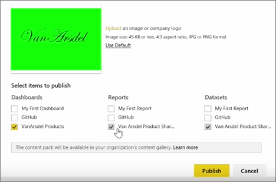
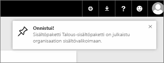

Tällä oppitunnilla luomme *sisältöpaketin*, joka sisältää Power BI:ssä jo olemassa olevia artefakteja ja jotka jaamme sitten työtovereille. 

**Omasta työtilastani** löytyy koontinäyttö, raportti sen alta sekä tietojoukko. Haluan jakaa ne pakettina muille organisaationi käyttäjille, jotta he voivat käyttää niitä uudelleen.

Kun valitsen **asetukset** kuvaketta (hammasrataskuvake-palvelun oikeasta), näen, paljonko tallennustilaa olen käyttänyt, ja voin luoda sovellus (aiemmalta nimeltään Sisältöpaketit).

Näyttöön avautuvassa valintaikkunassa voin valita, jaanko sisältöpaketin tietyille käyttäjille tai ryhmille, sekä antaa paketille nimen. Se kannattaa myös antaa tarkka kuvaus **kuvaus** ruutuun, jotta sisältöpaketteja selaavat käyttäjät sovelluksen tietää, mitä sisältöpakettisi sisältää ja tarjoaa.

Valintaikkunan alareunassa voin on ladata sisältöpaketille kuvan sovelluksen ja tärkein vaihe: Valitsen koontinäytön haluat sisällyttää sovellukseen, ja kun teen tämän, Power BI valitsee automaattisesti raportin ja tietojoukon, joita käytetään koontinäytössä. En voi poistaa valinta raportin tai tietojoukon, koska koontinäyttö, jonka haluat sisällyttää sovellukseen edellyttää niitä.

Voisin valita myös muita koontinäyttöjä, raportteja ja tietojoukkoja, mutta en tee sitä nyt.

Kun julkaisen sovelluksen lisätään organisaation sisältövalikoimaan.

Nyt on aika siirtyä seuraavan oppitunnin pariin!

