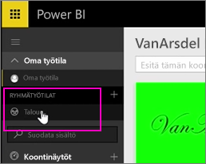
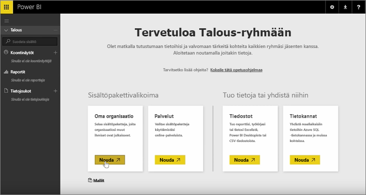
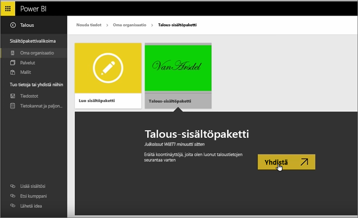
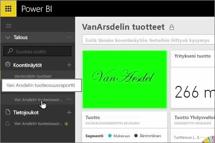
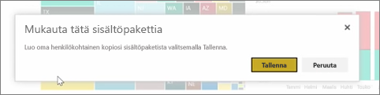
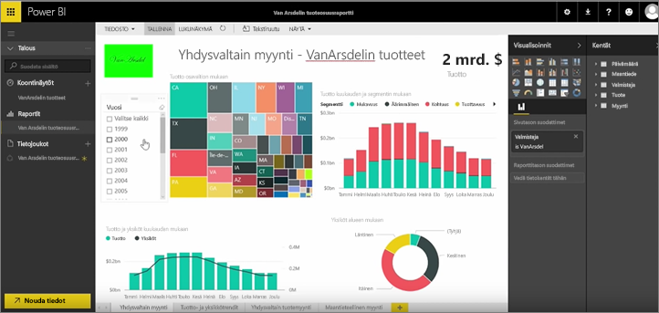

Olemme jo luoneet aiemmilla oppitunneilla sisältöpaketin ja ryhmän. Tällä oppitunnilla luon sisältöpaketista esiintymän kaikille ryhmän jäsenille.

Avaan ensin oman työtilani.

Sitten siirryn takaisin Rahoitus-ryhmään, jonka loin aiemmalla oppitunnilla.

Tässä ryhmässä ei ole vielä yhtään koontinäyttöä, raporttia tai tietojoukkoa. Aion käyttää aiemmin luotua sovellusta. Olen Selaa-organisaationi sijaan kolmannen osapuolen palveluiden sovelluksia.

Löydy minuutti sitten luotu sovellus. Nyt ymmärrän paremmin, miksi sisältöpaketille kannattaa antaa hyvä nimi, kuvaus ja kuva, jotta ihmiset löytävät sen. Muodostan yhteyden sisältöpakettiin.

Power BI tuo koontinäyttöjä, raportteja ja tietojoukkoja, jotka ovat sovelluksessa.

Kun valitsen tietojoukon, Power BI kysyy, haluanko muokata sovellusta.

Olen luodaan sovellus, jonka voin tehdä muutoksia kopiota, ja katkaiseminen sovelluksen julkaistuun versioon. Jos sovelluksen tekijä tekee muutoksia julkaistuun versioon, en saa näitä päivityksiä automaattisesti.

Mutta voin halutessani muokata koontinäyttöä, raporttia ja jopa tietojoukkoa.

Sovellus ovat siis yksinkertainen tapa käyttää uudelleen organisaatiosi muiden käyttäjien luoman sisällön.

Nyt on aika siirtyä seuraavan oppitunnin pariin!

