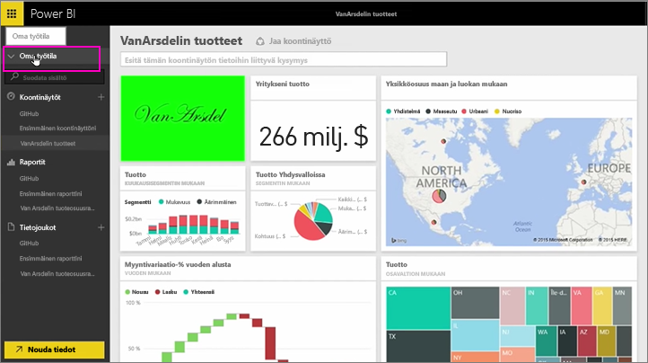
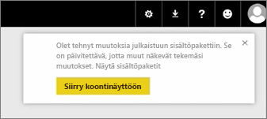
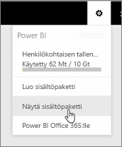
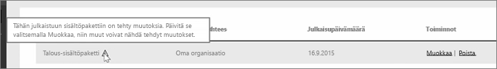
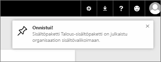

Tällä oppitunnilla muokkaamme aiemmin luotua alkuperäistä sisältöpakettia, jotta näemme, miten se päivittyy muille siihen yhteyden muodostaneille käyttäjille.

Olen taas täällä omassa työtilassa muokkaamassa alkuperäistä koontinäyttöäni.

Kun teen muutoksia koontinäyttöön, saan aina tämän muistutuksen siitä, että olen muokannut jotain muiden kanssa sisältöpaketissa jaettua, jolloin minua kehotetaan päivittämään jaettu versio.

Palaan asetuskuvakkeeseen ja valitsen **Näytä sisältöpaketti**, jolloin jo julkaisemani sisältöpaketit näytetään.

Näen tekemäni sisältöpaketin. Tästä pienestä kuvakkeesta näen, että olen muuttanut jotain tässä sisältöpaketissa ja että minun täytyy muokata sisältöpakettia, jotta muut näkevät muutokseni.

Kun valitsen **Muokkaa**, minut siirretään takaisin näyttöön, jossa voin muokata nimeä ja kuvausta. Tällä kertaa tässä on kuitenkin **Päivitä**-painike, joten napsautan sitä.

Power BI ottaa nämä muutokset ja julkaisee päivitetyn sisältöpaketin sisältöpakettivalikoimaan.

Kaikki, jotka ovat muodostaneet yhteyden sisältöpakettiini, saavat ilmoituksen siitä, että sisältöpaketti on muuttunut. Heiltä myös kysytään, haluavatko he hyväksyä muutokset vai pitää vanhemman version.

Sisältöpaketin omistajana voit siis hallita työtovereidesi käyttämiä versioita.

