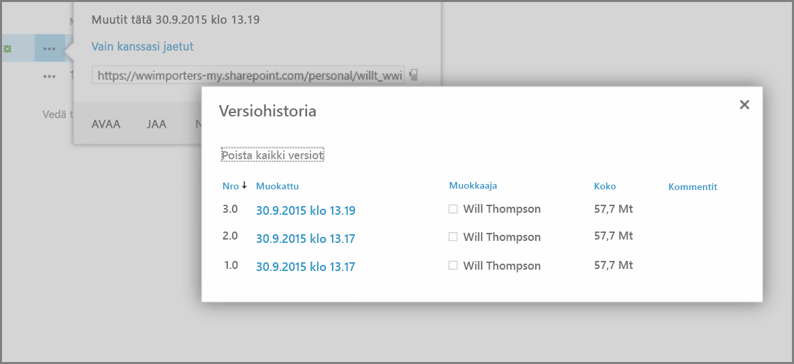
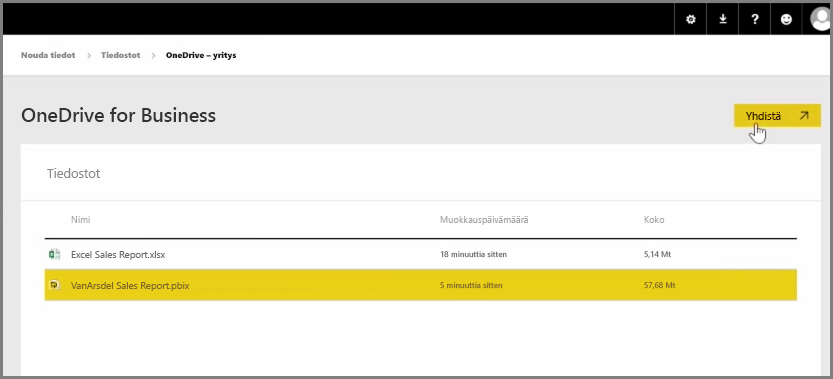
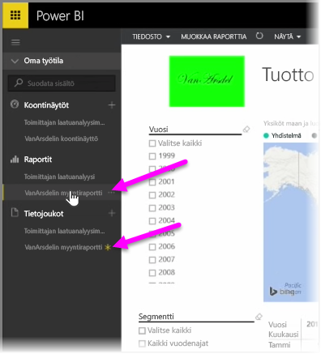

Aiemmassa artikkelissa käsittelimme ryhmien luomista: niiden avulla organisaatiosi voi hallita ja työstää yhteistyössä Power BI:n sisältöä. Power BI:n ja Office 365:n ryhmät tarjoavat myös mahdollisuuden tehdä yhteistyötä ja jakaa **OneDrive for Businessin** avulla.

Kun käytät OneDrive for Businessia Power BI -sisältösi lähteenä, voit hyödyntää monia hyödyllisiä työkaluja, esimerkiksi versiohistoriaa. Voit myös jakaa tiedostoja Office365 -ryhmässä OneDrive for Businessin avulla, kun haluat antaa monille käyttäjille oikeudet työstää samoja Power BI- tai Excel-tiedostoja.

Jos haluat yhdistää PBIX (Power BI Desktop) -tiedoston OneDrive for Businessissa, kirjaudu Power BI -palveluun ja valitse **Nouda tiedot**. Valitse Tuo tietoja tai yhdistä niihin -kohdassa **Tiedostot** ja valitse sitten **OneDrive – yritys**. Korosta valitsemasi tiedosto ja valitse sitten **Yhdistä**.

Näet sisältösi vasemmanpuoleisessa siirtymispalkissa.

Nyt kaikki tiedostoon **OneDrive for Businessissa** tekemäsi muutokset näkyvät automaattisesti Power BI -ympäristössä. Lisäksi ne kirjataan myös versiohistoriaan.

