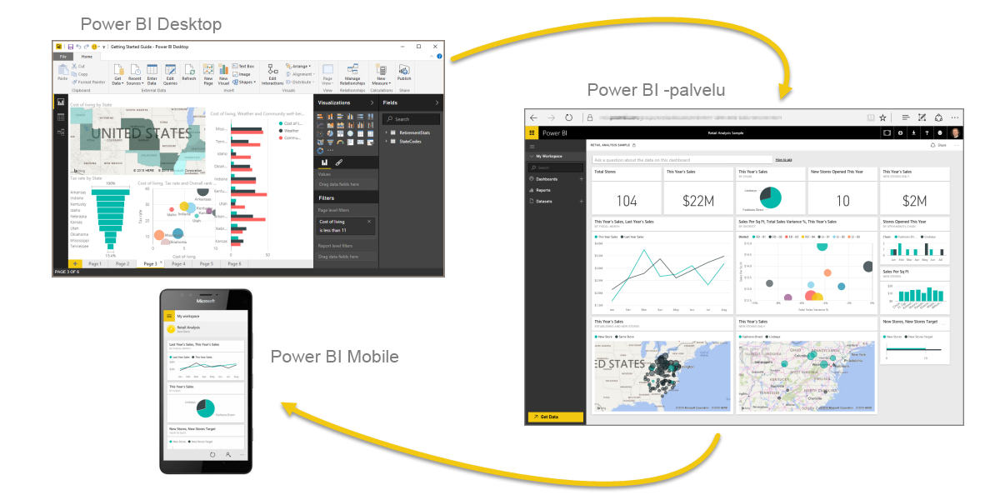
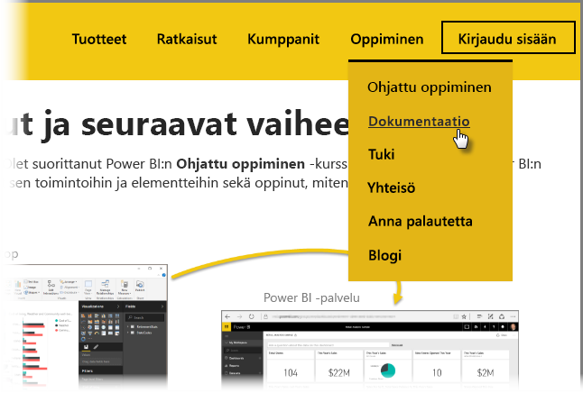

Teit sen! **Onnittelut!** Olet suorittanut Power BI:n **Ohjattu oppiminen** -kurssin. Olet nyt oppinut Power BI:n perusasiat, tutustunut sen toimintoihin ja elementteihin sekä oppinut, miten ne toimivat yhdessä.

Tämä on kurssin viimeinen osio (ja viimeinen aihe, ellet halua opetella DAX:n käyttöä). Jos siis suoritit kaikki osiot järjestyksessä, voit nyt onnitella itseäsi. Hienoa työtä! Osaat ja tunnet nyt kaikki seuraavat **tärkeät käsitteet** ja asiat:

* [Power BI:n kuvaus](../gettingstarted.yml#step-1)
* Power BI:n [osat](../gettingstarted.yml#step-3)
* tietojen [hankkiminen](../gettingdata.yml#step-3) ja [mallintaminen](../modeling.yml#step-1)
* [visualisoinnit](../visualizations.yml#step-1)
* [tietojen analysointi](../exploringdata.yml#step-1) Power BI -palvelussa
* [Excelin ja Power BI:n](../powerbiandexcel.yml#step-1) käyttäminen yhdessä
* omien töiden [julkaiseminen ja jakaminen](../publishingandsharing.yml#step-1).

Olet siis oppinut paljon, joten nyt on aika panna oppimasi hyvään käyttöön! Tässä on joitain **linkkejä ladattaviin resursseihin** sekä selaimen **yhdistämiseen Power BI -palveluun**:

* Voit tietysti myös hankkia [Power BI Desktopin uusimman version](https://powerbi.microsoft.com/desktop) milloin tahansa.
* [Power BI -palveluun](https://powerbi.microsoft.com/) siirtyminen on helppoa.
* [Power BI -mobiilisovellukset](https://powerbi.microsoft.com/mobile/) ovat myös vain napautuksen päässä.

Tarjolla on myös runsaasti muuta **ohje- ja tukisisältöä**. Siirry vain tämän sivun alkuun ja valitse **Oppiminen > Dokumentaatio**. Näin näet koko Power BI:n laajan ohjesisältövalikoiman.

Toivomme, että olet nauttinut **Power BI:n ohjatusta oppimisesta**. Toivotamme sinulle onnea jatkoon, olkoon Power BI -visualisointisi aina tehokkaita ja tyylikkäitä!

## Lisäosio DAX-käyttäjille
Haluatko lisää? Oletko kiinnostunut **DAX:stä (Data Analysis Expressions)**, jolla voit luoda, suodattaa ja käyttää omia sarakkeita ja taulukoita Power BI:ssä? Tarjolla on vielä yksi osio käyttäjille, jotka haluavat hyödyntää koodia Power BI:ssä. Se on nimeltään **Johdanto DAXiin**. Jos tämä kiinnostaa sinua, tutustu ihmeessä myös siihen. Sisältö on yhtä helppokäyttöistä kuin muukin ohjatun oppimisen sisältö.

