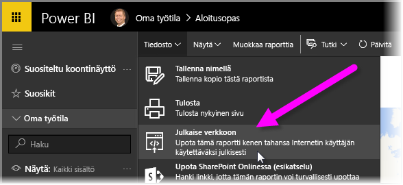
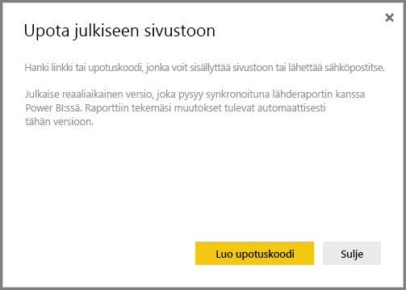
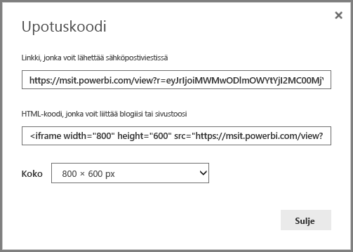
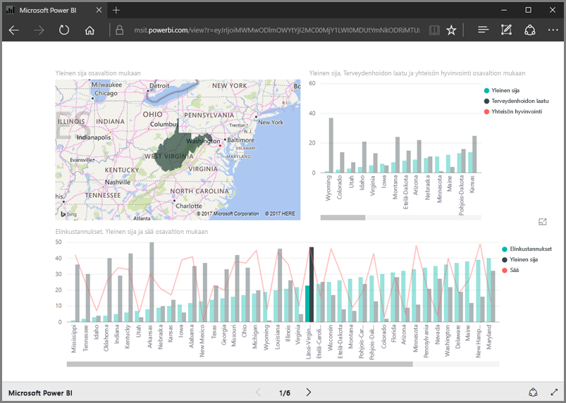
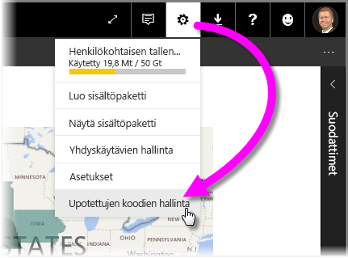
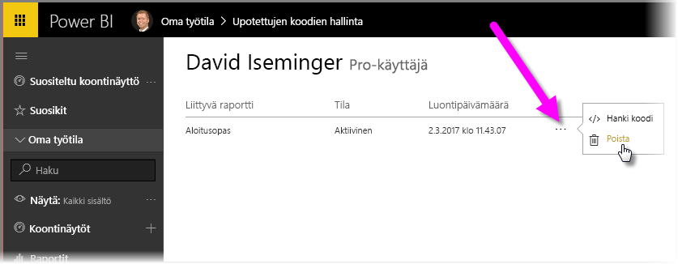

Tällä oppitunnilla opit jakamaan Power BI -raportin verkkosivulla tai sähköpostitse muutaman helpon toimenpiteen avulla. Tätä Power BI:n toimintoa, jonka käyttö ja hallinta on helppoa, kutsutaan usein **verkkoon julkaisemiseksi**.

Valitse Power BI:ssä raportti, jonka haluat jakaa, jotta näet sen pohjalla. Valitse sitten valikosta **Tiedosto > Julkaise verkkoon**.

Tämän jälkeen näyttöön avautuu valintaikkuna, jossa sinulla kerrotaan, että saat *upotuskoodin*, jolla voit sisällyttää raportin verkkosivulle tai sähköpostiin.

Kun valitset **Luo upotuskoodi**, Power BI avaa toisen valintaikkunan, jossa ilmoitetaan, että olet jakamassa tietoja kaikkien kanssa Internetissä. Varmista, että tämä on varmasti OK!

Power BI avaa valintaikkunan, jossa on kaksi linkkiä:

* Siinä on linkki, jonka voit jakaa sähköpostitse ja joka näyttää raportin verkkosivuna.
* Siinä on HTML-koodi (linkki iframe-kehyksessä), jotta voit upottaa raportin suoraan verkkosivulle.

HTML-linkkiä käyttäessäsi voit valita jonkin valmiin kokovaihtoehdon upotetulle raportille tai voit muokata iframe-kehyksen koodia ja tällä tavalla myös sen kokoa.

Voit liittää sähköpostilinkin suoraan selaimeen: näin näet raportin verkkosivuna. Voit käyttää tätä verkkosivua samalla tavalla kuin raporttia Power BI:ssä. Seuraavissa kuvissa näytetään **Julkaise verkkoon** -sivu, kun sen linkki on kopioitu suoraan sen valintaikkunasta selaimeen:

Voit lisäksi upottaa iframe-linkin blogitekstiin, verkkosivustoon ja myös Swayhin.

Haluatko poistaa luomasi upotuskoodin? Se onnistuu helposti. Napsauta Power BI:n oikean yläkulman **hammasrataskuvaketta** ja valitse sitten **Upotettujen koodien hallinta**.

Power BI -työtila näyttää luomasi upotuskoodit (alla olevassa kuvassa niitä on vain yksi). Kun napsautat kolmea pistettä, voit hankkia upotuskoodin valitsemalla sen. Voit myös poistaa upotuskoodin kokonaan.

Näin helppoa on Power BI -raportin julkaiseminen ja jakaminen verkossa koko maailmalle. Todella helppoa, vai mitä?

