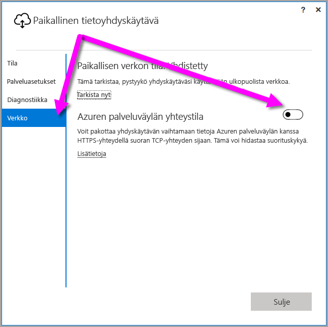

## <a name="sign-in-account"></a>Kirjautumistili

Käyttäjät kirjautuvat sisään joko työpaikan tai oppilaitoksen tilillä. Tämä tili on käyttäjän **organisaatiotili**. Jos olet tilannut Office 365 -tarjooman etkä ole antanut todellista työsähköpostiasi, tilisi voi näyttää tältä: nancy@contoso.onmicrosoft.com. Tilisi on tallennettu vuokraajaan Azure Active Directoryssa (AAD). Useimmissa tapauksissa Azure Active Directory -tilin täydellinen käyttäjätunnus vastaa sähköpostiosoitetta.

## <a name="windows-service-account"></a>Windows-palvelutili

Paikallinen tietoyhdyskäytävä on määritetty käyttämään *NT SERVICE\PBIEgwService* -palvelua Windows-palvelun sisäänkirjautumisen tunnistetiedoille. Sillä on oletusarvoinen sisäänkirjautumisoikeus palveluna sen laitteen kontekstissa, johon olet yhdyskäytävää asentamassa. Tämä ei ole sama tili kuin se, jota käytetään yhteyden muodostamiseen paikallisiin tietolähteisiin. Tämä ei myöskään ole se työpaikan tai oppilaitoksen tili, jolla kirjaudut pilvipalveluihin.

> [!NOTE]
> Jos olet valinnut henkilökohtaisen tilan, voit määrittää Windows-palvelutilin erikseen.

Jos kohtaat todentamisongelmia välityspalvelimen kanssa, yritä vaihtaa Windows-palvelutili toimialuekäyttäjäksi tai hallituksi palvelutiliksi. Lisätietoja on ohjeaiheessa [Välityspalvelimen määritys](../service-gateway-proxy.md#changing-the-gateway-service-account-to-a-domain-user).

## <a name="ports"></a>Portit

Yhdyskäytävä luo lähtevän yhteyden Azuren palveluväylään. Se viestii lähtevien porttien kautta: TCP 443 (oletusarvoinen), 5671, 5672, 9350–9354.  Yhdyskäytävä ei vaadi saapuvia portteja.

Suosittelemme, että lisäät tietoalueesi IP-osoitteet sallittujen luetteloon palomuurin asetuksissa. Voit ladata viikoittain päivitettävän [Microsoft Azuren palvelinkeskusten IP-osoiteluettelon](https://www.microsoft.com/download/details.aspx?id=41653). Voit myös noutaa tarvittavien porttien luettelon suorittamalla [Verkkoporttien testauksen](../service-gateway-onprem-tshoot.md#network-ports-test) paikallisen tietoyhdyskäytäväsovelluksen kautta. Yhdyskäytävä vaihtaa tietoja Azuren palveluväylän kanssa käyttämällä IP-osoitetta ja täydellistä toimialuenimeä (FQDN). Jos pakotat yhdyskäytävän vaihtamaan tietoja HTTPS-yhteyden kautta, se käyttää ainoastaan FQDN:ää ja tietojen vaihtoa IP-osoitteita käyttämällä ei tapahdu lainkaan.


> [!NOTE]
> Azuren palvelinkeskusten IP-osoiteluettelossa käytetään CIDR-merkintätapaa. Esimerkiksi 10.0.0.0/24 ei tarkoita 10.0.0.0–10.0.0.24. Lue lisätietoja [CIDR-merkintätavasta](http://whatismyipaddress.com/cidr).

Tässä on luettelo yhdyskäytävän käyttämistä täysin valtuutetuista toimialuenimistä.

| Toimialuenimet | Lähtevien pyyntöjen portit | Kuvaus |  |
|-----------------------------|----------------|--------------------------------------------------------------------------------------------------------------------|---|
| *. download.microsoft.com | 80 | Käytetään asennusohjelman lataamiseen. Tätä käytetään myös tietoyhdyskäytäväsovelluksen version ja yhdyskäytävän alueen tarkistamiseen. |  |
| *.powerbi.com | 443 | Käytetään asianmukaisten Power BI -klusterien tunnistamiseen. |  |
| *.analysis.windows.net | 443 | Käytetään asianmukaisten Power BI -klusterien tunnistamiseen. |  |
| *.login.windows.net | 443 | Käytetään tietoyhdyskäytäväsovelluksen todennukseen Azure Active Directoryn / OAuth2:n kautta. |  |
| *.servicebus.windows.net | 5671–5672 | Käytetään Advanced Message Queuing Protocol (AMQP) -protokollan kanssa. |  |
| *.servicebus.windows.net | 443, 9350–9354 | Microsoft Azuren palveluväylän (TCP) kuuntelijoiden käytössä (edellyttää 443:n käyttöoikeuksien valvontatunnuksen hankintaa varten). |  |
| *.frontend.clouddatahub.net | 443 | Vanhentunut – ei enää tarpeellinen. Poistetaan ohjeista tulevaisuudessa. |  |
| *.core.windows.net | 443 | Käytetään Power BI:n tietovuossa tietojen tallentamiseksi Azure Data Lakeen. |  |
| login.microsoftonline.com | 443 | Käytetään tietoyhdyskäytäväsovelluksen todennukseen Azure Active Directoryn / OAuth2:n kautta. |  |
| *.msftncsi.com | 443 | Käytetään testattaessa internetyhteyttä ja sitä, saako Power BI -palvelu yhteyden yhdyskäytävään. |  |
| *.microsoftonline-p.com | 443 | Käytetään tietoyhdyskäytäväsovelluksen todennukseen Azure Active Directoryn / OAuth2:n kautta. |  |
| | |

> [!NOTE]
> Kun yhdyskäytävä on asennettu ja rekisteröity, vain Azuren palveluväylän edellyttämät portit/IP-osoitteet vaaditaan (yllä servicebus.windows.net). Voit noutaa tarvittavien porttien luettelon suorittamalla [Verkkoporttien testauksen](../service-gateway-onprem-tshoot.md#network-ports-test) paikallisen tietoyhdyskäytäväsovelluksen kautta.

## <a name="forcing-https-communication-with-azure-service-bus"></a>HTTPS-tiedonsiirron pakottaminen Azuren palveluväylän kanssa

Voit pakottaa yhdyskäytävän vaihtamaan tietoja Azuren palveluväylän kanssa HTTPS-yhteydellä suoran TCP-yhteyden sijaan.

> [!NOTE]
> Kesäkuun 2019 julkaisusta eteenpäin uudet asennukset (ei koske päivityksiä) käyttävät oletuksena HTTPS-protokollaa TCP:n sijaa Azuren palveluväylän suositusten mukaisesti.

Voit pakottaa HTTPS-yhteyden käyttöön muokkaamalla *Microsoft.PowerBI.DataMovement.Pipeline.GatewayCore.dll.config* -tiedostoa muuttamalla arvon `AutoDetect` arvoksi `Https`suoraan tämän kappaleen jälkeen esitetyn koodikatkelman mukaisesti. Tiedosto löytyy (oletusarvoisesti) sijainnista *C:\Program Files\On-premises data gateway*.

```xml
<setting name="ServiceBusSystemConnectivityModeString" serializeAs="String">
    <value>Https</value>
</setting>
```

*ServiceBusSystemConnectivityModeString*-parametrin arvossa kirjainkoko on merkitsevä. Kelvolliset arvot ovat *Automaattinen tunnistus* ja *Https*.

Vaihtoehtoisesti voit pakottaa yhdyskäytävän valitsemaan tämän tavan käyttämällä yhdyskäytävän käyttöliittymää. Valitse yhdyskäytävän käyttöliittymässä **Verkko** ja ota **Azuren palveluväylän yhteystila** **käyttöön**.



Kun se on vaihdettu ja kun valitset **Käytä** (painike, joka tulee näkyviin vain, kun teet muutoksen), *yhdyskäytävän Windows-palvelu* käynnistyy automaattisesti uudelleen, jotta muutokset tulevat voimaan.

Vastaisuudessa voit käynnistää *yhdyskäytävän Windows-palvelun* uudelleen valitsemalla käyttöliittymä-valintaikkunasta **Palveluasetukset** ja sitten *Käynnistä uudelleen nyt*.


## <a name="support-for-tls-12"></a>TLS 1.2:n tuki

Paikallinen yhdyskäytävä on oletusarvoisesti yhteydessä Power BI -palveluun Transport Layer Security (TLS) 1.2:lla. Jotta voit varmistaa, että yhdyskäytäväliikenne käyttää TLS 1.2:ta, sinun pitää ehkä lisätä seuraavat rekisteriavaimet koneeseen, joka suorittaa yhdyskäytäväpalvelua, tai muokata niitä siinä:

```
[HKEY_LOCAL_MACHINE\SOFTWARE\Microsoft\.NETFramework\v4.0.30319]"SchUseStrongCrypto"=dword:00000001
[HKEY_LOCAL_MACHINE\SOFTWARE\Wow6432Node\Microsoft\.NETFramework\v4.0.30319]"SchUseStrongCrypto"=dword:00000001
```

> [!NOTE]
> Näiden rekisteriavaimien lisääminen tai muokkaaminen ottaa muutoksen käyttöön kaikissa .NET-sovelluksissa. Jos haluat lisätietoja rekisterimuutoksista, jotka vaikuttavat muiden sovellusten TLS:ään, lue ohjeartikkeli [Transport Layer Securityn (TLS) rekisteriasetukset](https://docs.microsoft.com/windows-server/security/tls/tls-registry-settings).

## <a name="how-to-restart-the-gateway"></a>Yhdyskäytävän uudelleenkäynnistys

Yhdyskäytävä toimii Windows-palveluna. Voit käynnistää ja pysäyttää sen kuten minkä tahansa Windows-palvelun. Tässä kerrotaan, miten voit tehdä sen komentokehotteesta.

1. Tietokoneessa, jossa yhdyskäytävä on käynnissä, käynnistetään järjestelmänvalvojan komentokehote.
2. Käytä seuraavaa komentoa palvelun pysäyttämiseen.
   
   net stop PBIEgwService
3. Käytä seuraavaa komentoa palvelun käynnistämiseen.
   
   net start PBIEgwService

