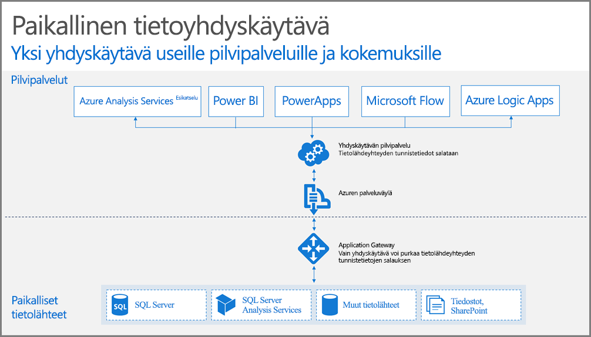

## Yhdyskäytävän toiminta

Tarkastellaan ensin, mitä tapahtuu, kun käyttäjä käyttää paikalliseen tietolähteeseen liitettyä elementtiä. 

> [!NOTE]
> Power BI:n kohdalla yhdyskäytävälle on määritettävä tietolähde.
> 
> 

1. Pilvipalvelu luo kyselyn sekä salatut tunnistetiedot paikalliselle tietolähteelle, ja nämä lähetetään jonoon yhdyskäytävän käsiteltäväksi.
2. Yhdyskäytävän pilvipalvelu analysoi kyselyn ja lähettää pyynnön [Azuren Palveluväylään](https://azure.microsoft.com/documentation/services/service-bus/).
3. Paikallinen tietoyhteyskäytävä tekee kyselyn [Azuren Palveluväylään](https://azure.microsoft.com/documentation/services/service-bus/) odottavia pyyntöjä varten.
4. Yhdyskäytävä saa kyselyn, purkaa salauksen tunnistetiedot ja muodostaa yhteyden tietolähteisiin kyseisillä tunnistetiedoilla.
5. Yhdyskäytävä lähettää kyselyn tietolähteeseen suoritusta varten.
6. Tulokset lähetetään tietolähteestä takaisin yhdyskäytävään ja sitten pilvipalveluun. Sitten palvelu ottaa tulokset käyttöön.

