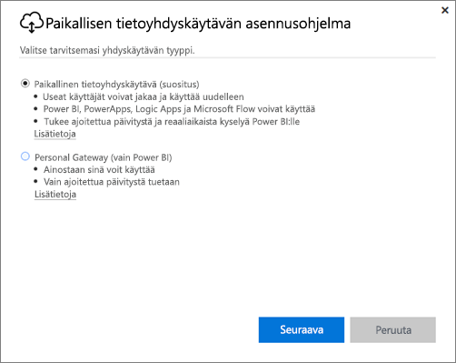
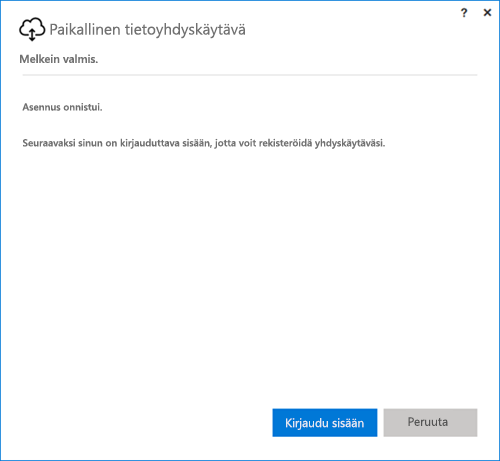
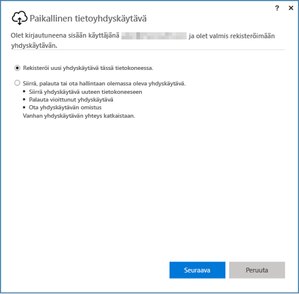
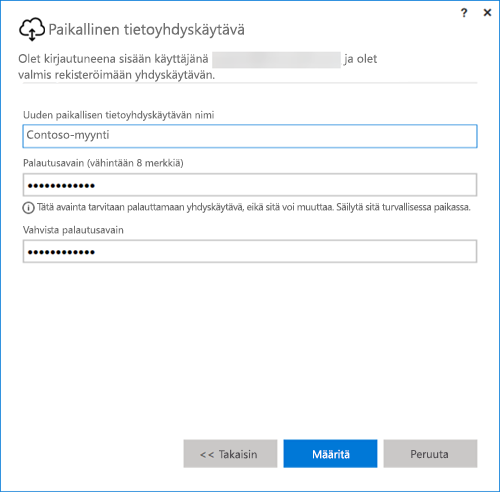

## Paikallisen tietoyhdyskäytävän asentaminen
Tietoyhdyskäytävä asennetaan tietokoneellesi, jossa se myös suoritetaan. Yhdyskäytävä kannattaa asentaa koneelle, jota pidetään käynnissä yhtäjaksoisesti.

> [!NOTE]
> Yhdyskäytävälle on tuki vain 64-bittisissä Windows-käyttöjärjestelmissä.
> 
> 

Power BI:ssä sinun on valittava ensiksi yhdyskäytävän tila.

* **Paikallinen tietoyhdyskäytävä:** tässä tilassa useat käyttäjät voivat jakaa yhdyskäytävän ja käyttää sitä uudelleen. Tällaista yhdyskäytävää voi käyttää Power BI:ssä, PowerAppsissa, Flow’ssa ja Logic Appsissa. Power BI:ssä yhdyskäytävällä on tuki päivityksen ajastamiselle ja DirectQuerylle.
* **Henkilökohtainen:** tämä tila toimii vain Power BI:ssä ja sitä voi käyttää yksi henkilö ilman järjestelmänvalvojalta vaadittavia määritystoimia. Tilassa voi käyttää vain pyydettävää päivitystä ja päivityksen ajastamista. Tämän vaihtoehdon valitseminen käynnistää henkilökohtaisen yhdyskäytävän asennuksen.

Kumpaakin yhdyskäytävätilaa koskevat seuraavat seikat, jotka tulee ottaa huomioon asentamisessa:

* Molemmat yhdyskäytävät edellyttävät 64-bittistä Windows-käyttöjärjestelmää.
* Yhdyskäytäviä ei voi asentaa toimialueen ohjauskoneeseen.
* Voit asentaa enintään kaksi paikallista tietoyhdyskäytävää samaan tietokoneeseen, ja ne on suoritettava keskenään eri tilassa (henkilökohtainen ja vakio). 
* Samassa tietokoneessa ei voida suorittaa samassa tilassa useampaa kuin yhtä yhdyskäytävää.
* Voit asentaa useita paikallisia tietoyhdyskäytäviä eri tietokoneisiin ja hallita niitä kaikkia samasta Power BI -yhdyskäytävän hallintaliittymästä (ei koske henkilökohtaista tietoyhdyskäytävää, katso seuraava luettelokohta).
* Kullekin Power BI -käyttäjälle voidaan suorittaa vain yhtä henkilökohtaisen tilan yhdyskäytävää. Jos asennat toisen henkilökohtaisen tilan yhdyskäytävän samalle käyttäjälle, edes toiseen tietokoneeseen, uudempi asennus korvaa aiemmin tehdyn asennuksen.

Seuraavassa on muutamia asioita, joita kannattaa pohtia ennen yhdyskäytävän asentamista.

* Jos suunnittelet asentavasi yhdyskäytävän kannettavaan tietokoneeseen, yhdyskäytävä ei toimi silloin, kun kannettava on sammutettuna, se ei ole yhteydessä verkkoon tai se on virransäästötilassa. Tällöin pilvipalvelussa olevia tietoja ei voida synkronoida paikallisten tietojen kanssa.
* Jos tietokone on yhdistetty langattomaan verkkoon, yhdyskäytävä saattaa toimia hitaammin, minkä seurauksena pilvipalvelussa olevien tietojen synkronoimiseen paikallisten tietojen kanssa kuluu enemmän aikaa.

Kun yhdyskäytävä on asennettu, sinun on kirjauduttava sisään käyttämällä työpaikan tai oppilaitoksen tiliä.

Kun olet kirjautunut sisään, voit valita, haluatko määrittää uuden yhdyskäytävän vaiko siirtää, palauttaa tai ottaa hallintaasi aiemmin luodun yhdyskäytävän.

## Uuden yhdyskäytävän määrittäminen
1. Anna yhdyskäytävälle **nimi**.
2. Anna **palautusavain**. Sen on oltava vähintään 8 merkkiä.
3. Valitse **Määritä**.

> [!NOTE]
> Palautusavainta tarvitaan, jos sinun on joskus siirrettävä tai palautettava yhdyskäytävä tai otettava se hallintaasi. Muista säilyttää avain turvallisessa paikassa.
> 
> 

### Olemassa olevan yhdyskäytävän siirtäminen, palauttaminen tai ottaminen hallintaan
Valitse palautettava yhdyskäytävä ja anna palautusavain, jota käytettiin kyseisen yhdyskäytävän luomisen yhteydessä.

### Yhdistetty paikallinen tietoyhdyskäytävä
Kun yhdyskäytävä on määritetty, pystyt muodostamaan sen avulla yhteyden paikallisiin tietolähteisiin.

Jos yhdyskäytävä on tehty Power BI:hin, sinun on lisättävä tietolähteet yhdyskäytävää varten Power BI-palvelusta. Se tehdään **Yhdyskäytävien hallinta** ‑alueella. Lisätietoja saat tietolähteiden hallintaa käsittelevistä artikkeleista.

PowerApps-sovelluksia varten sinun on valittava yhdyskäytävä, jotta voit määrittää yhteyden tuettuihin tietolähteisiin. Flow- ja Logic Apps ‑sovelluksissa yhdyskäytävä on valmiina käytettäväksi paikallisten yhteyksien kanssa.

