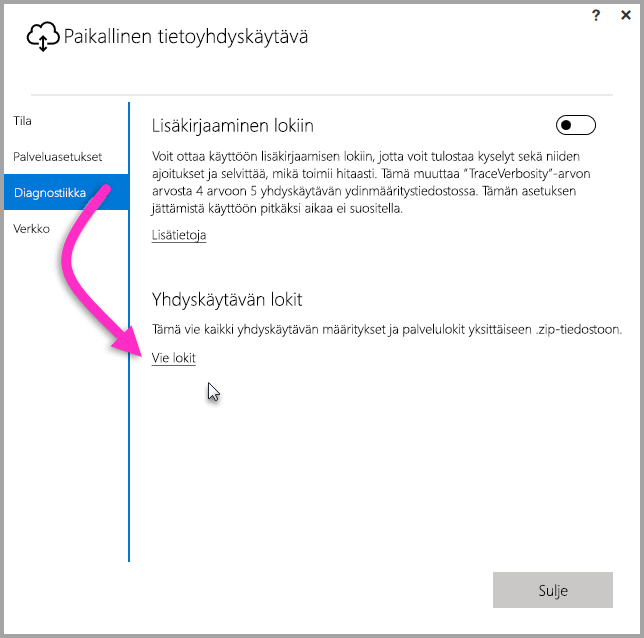
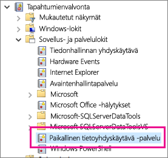

## Työkalut vianmääritykseen
<a name="logs" />

### Lokien kerääminen yhdyskäytävän määritystoiminnosta
Voit kerätä useita lokeja yhdyskäytävään, ja aina kannattaa aloittaa lokeista. Yksinkertaisin tapa kerätä lokit yhdyskäytävän asentamisen jälkeen on käyttöliittymän kautta. Valitse **Paikallinen tietoyhdyskäytävä** -käyttöliittymässä **Diagnostiikka** ja valitse sitten sivun alalaidassa oleva **Vie lokit** -linkki seuraavan kuvan mukaisesti.

**Asennusohjelman lokit**

    %localappdata%\Temp\On-premises_data_gateway_*.log

**Määrityksen lokit**

    %localappdata%\Microsoft\On-premises Data Gateway\GatewayConfigurator*.log

**Paikallisen tietoyhdyskäytävän palvelulokit**

    C:\Users\PBIEgwService\AppData\Local\Microsoft\On-premises Data Gateway\Gateway*.log

### Tapahtumalokit
**Paikallisen tietoyhdyskäytäväpalvelun** tapahtumalokit on esitetty kohdassa **Sovellukset ja palvelulokit**.

<a name="fiddler" />

### Fiddler-jäljitys
[Fiddler](http://www.telerik.com/fiddler) on Telerikin ilmainen työkalu, joka valvoo HTTP-liikennettä.  Voit tarkastella Power BI -palvelun tiedonsiirtoa asiakaskoneelta. Tämä saattaa näyttää virheitä ja muita olennaisia tietoja.

