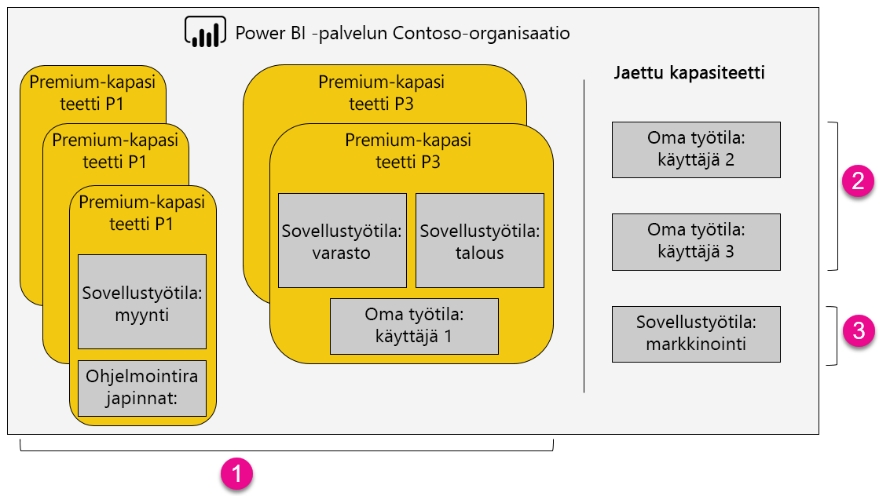

1. Premium-kapasiteetin sisältämät kohteet
   
   * Sovellustyötilojen käyttäminen (jäsenenä tai järjestelmänvalvojana) edellyttää Power BI Pro -käyttöoikeutta.

   * Sovelluksen jakaminen edellyttää Pro-käyttöoikeutta, mutta sitä ei edellytetä sovellukseen käyttämiseen.

   * Kaikki koontinäytön vastaanottajat voivat määrittää tietoilmoituksia heille myönnetystä käyttöoikeudesta riippumatta.

   * Upottamiseen tarkoitetut REST-ohjelmointirajapinnat käyttävät käyttäjätilin sijasta palvelutiliä, jolla on Pro-käyttöoikeus.

2. Oma työtila jaetussa kapasiteetissa
   
   * Sovelluksen jakaminen ja käyttäminen edellyttävät kumpikin Pro-käyttöoikeutta.

3. Sovellustyötilat jaetussa kapasiteetissa
   
   * Minkä tahansa sovelluksen käyttäminen edellyttää Pro-käyttöoikeutta.

