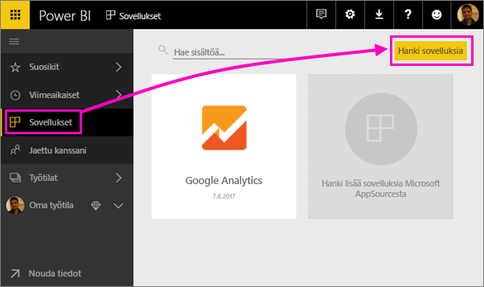
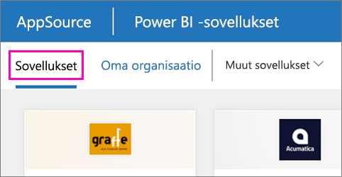

1. Valitse **Sovellukset** vasemmanpuoleisessa siirtymisruudussa > valitse **Hanki sovelluksia** oikeassa yläkulmassa.
   
     
2. Valitse AppSourcessa **Sovellukset**-välilehti ja hae haluamaasi palvelua.
   
    

