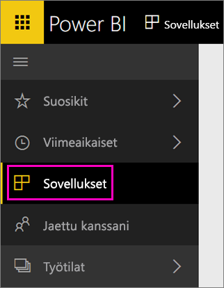

Kun tuonti on valmis, uusi sovellus ilmestyy Sovellukset-sivulle.

1. Valitse vasemmassa siirtymisruudussa **Sovellukset** ja valitse sovellus.
   
     
2. Voit esittää kysymyksen kirjoittamalla kysymysten ja vastausten ruutuun tai napsauttamalla ruutua pohjana olevan raportin avaamiseksi. 

