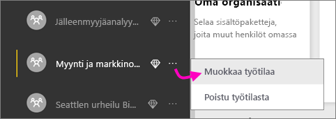

1. Aloita luomalla työtila. Valitse **Työtilat** > **Luo sovelluksen työtila**.
   
     
   
    Sinne voit sijoittaa sisältöä, jota sinä ja työtoverisi voitte käyttää yhdessä.

2. Anna työtilalle nimi. Jos vastaava **työtilan tunnus** ei ole käytettävissä, muokkaa nimeä niin, että saat yksilöllisen tunnuksen.
   
     Siitä tulee myös sovelluksen nimi.
   
     

3. Sinun täytyy määrittää joitakin asetuksia. Jos valitset vaihtoehdon **Julkinen**, kuka tahansa organisaatiossasi voi nähdä, mitä työtilassa on. **Yksityinen** puolestaan tarkoittaa, että vain työtilan jäsenet voivat nähdä sen sisällön.
   
     
   
    Julkinen/Yksityinen-asetusta ei voi enää muuttaa, kun olet kerran luonut ryhmän.

4. Voit myös valita, onko jäsenillä **muokkaus-** vai **vain tarkastelu** ‑käyttöoikeudet.
   
     
   
     Lisää ihmisiä sovelluksen työtilaan vain, jotta he voisivat muokata sisältöä. Jos he vain tarkastelisivat sisältöä, älä lisää heitä työtilaan. Voit sisällyttää heidät sitten, kun julkaiset sovelluksen.

5. Lisää niiden ihmisten sähköpostiosoitteet, joille haluat antaa työtilan käyttöoikeudet, ja valitse **Lisää**. Et voi lisätä ryhmien aliaksia, vain yksittäisiä ihmisiä.

6. Päätä, onko kukin henkilö jäsen vai järjestelmänvalvoja.
   
     
   
    Järjestelmänvalvojat voivat muokata työtilaa itse ja muun muassa lisätä muita jäseniä. Jäsenet voivat muokata sisältöä työtilassa, ellei heillä ole käyttöoikeudet pelkästään tarkasteluun. Sekä järjestelmänvalvojat että jäsenet voivat julkaista sovelluksen.

7. Valitse **Tallenna**.

Power BI luo työtilan ja avaa sen. Työtila ilmestyy luetteloon työtiloista, joiden jäsen olet. Järjestelmänvalvojana voit valita kolme pistettä (...) ja palata takaisin tekemään työtilaan muutoksia, lisäämään uusia jäseniä ja muuttamaan jäsenten käyttöoikeuksia.

