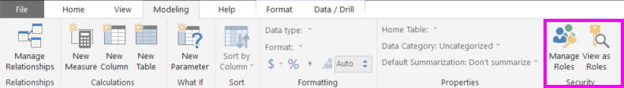
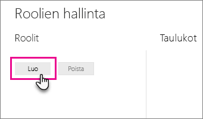
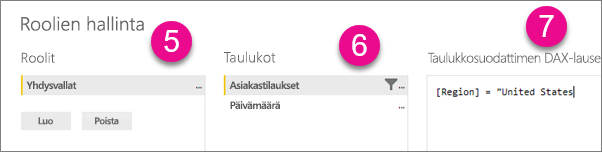
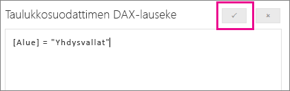

## Roolien ja sääntöjen määrittäminen Power BI Desktopissa
Power BI Desktopissa voit määrittää rooleja ja sääntöjä. Kun julkaiset Power BI:ssä, myös roolimääritykset julkaistaan.

Voit määrittää käyttöoikeusroolit seuraavien ohjeiden mukaisesti.

1. Tuo tietoja Power BI Desktop ‑raporttiin tai määritä DirectQuery-yhteys.
   
   > [!NOTE]
   > Power BI Desktopissa ei voi määrittää rooleja reaaliaikaisille Analysis Services -yhteyksille. Ne täytyy määrittää Analysis Services -mallin sisältä.
   > 
   > 
1. Valitse **Mallinnus**-välilehti.
2. Valitse **Roolien hallinta**.
   
   
4. Valitse **Luo**.
   
   
5. Anna roolille nimi. 
6. Valitse taulukko, johon haluat käyttää DAX-sääntöä.
7. Anna DAX-lausekkeet. Lausekkeen tulisi palauttaa joko arvo tosi tai epätosi. Esimerkki: [Entiteetin tunnus] = ”arvo”.
   
   > [!NOTE]
   > Voit käyttää lausekkeessa funktiota *username()*. Huomaa, että *username()* on Power BI Desktopissa muodossa *TOIMIALUE\käyttäjänimi*. Power BI -palvelussa ja Power BI -raporttipalvelimessa se ilmoitetaan täydellisenä käyttäjätunnuksena. Vaihtoehtoisesti voit käyttää funktiota *userprincipalname()*, joka palauttaa aina käyttäjän täydellisen käyttäjätunnuksen, *username\@contoso.com*.
   > 
   > 
   
   
8. Kun olet luonut DAX-lausekkeen, voit vahvistaa sen valitsemalla lausekeruudun yläpuolelta valintamerkkikuvakkeen.
   
   
9. Valitse **Tallenna**.

Käyttäjille ei voi määrittää roolia Power BI Desktopissa. Voit määrittää ne Power BI -palvelussa. Voit ottaa käyttöön Power BI Desktopin dynaamiset suojausominaisuudet hyödyntämällä *username()*- tai *userprincipalname()*-DAX-funktioita, kun oikeat suhteet on määritetty. 

